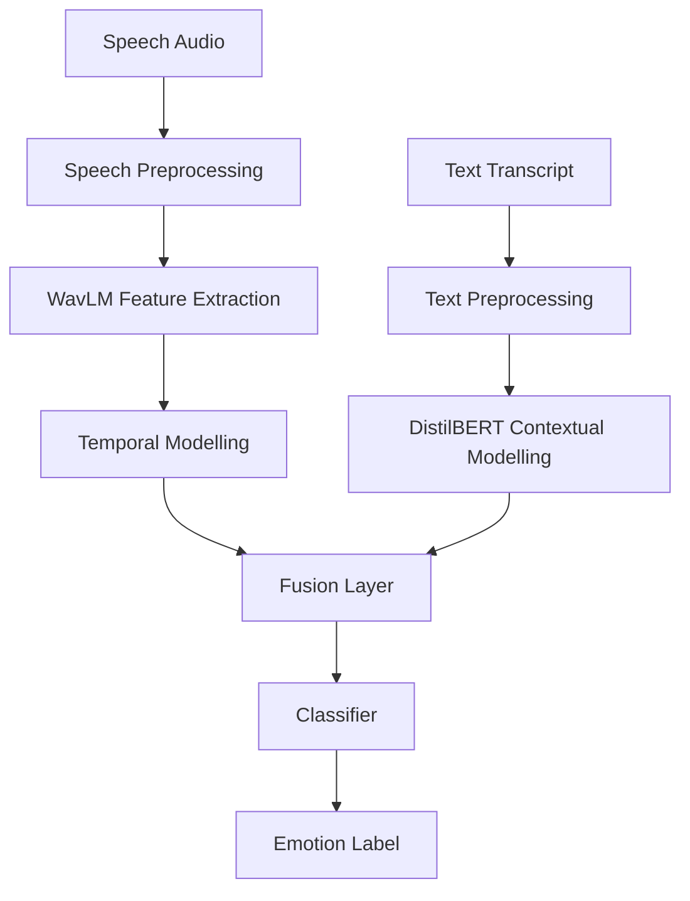

# Multimodal Emotion Recognition

This project implements a complete **Multimodal Emotion Recognition System** using the **Toronto Emotional Speech Set (TESS)** dataset. The system predicts human emotional states using three separate machine learning pipelines:

1. **Speech Emotion Recognition Pipeline**
2. **Text Emotion Recognition Pipeline**
3. **Multimodal Fusion Emotion Recognition Pipeline**

The project is designed to compare unimodal emotion recognition methods with a multimodal fusion approach. The speech pipeline uses acoustic emotion cues from audio. The text pipeline uses transcript words extracted from TESS filenames. The fusion pipeline combines both speech and text representations to produce the final emotion prediction.

The final fusion model uses:

- **WavLM** for speech/audio representation learning
- **DistilBERT** for text/contextual representation learning
- **Feature fusion** using concatenation
- **MLP classifier** for final emotion classification

The project includes preprocessing, training, testing, result generation, plots, saved models, and GUI-based prediction applications.

---

## Table of Contents

1. [Project Objective](#project-objective)
2. [Dataset](#dataset)
3. [Emotion Classes](#emotion-classes)
4. [Project Folder Structure](#project-folder-structure)
5. [Overall Pipeline Architecture](#overall-pipeline-architecture)
6. [Speech Pipeline](#speech-pipeline)
7. [Text Pipeline](#text-pipeline)
8. [Fusion Pipeline](#fusion-pipeline)
9. [How to Run the Project](#how-to-run-the-project)
10. [How to Run Each File](#how-to-run-each-file)
11. [Output Files and Their Purpose](#output-files-and-their-purpose)
12. [Results and Evaluation](#results-and-evaluation)
13. [Text Pipeline Result Analysis](#text-pipeline-result-analysis)
14. [Fusion Pipeline Result Analysis](#fusion-pipeline-result-analysis)
15. [What Can Be Inferred From This Method](#what-can-be-inferred-from-this-method)
16. [Limitations](#limitations)
17. [Future Improvements](#future-improvements)
18. [Conclusion](#conclusion)

---

## Project Objective

The objective of this project is to classify emotional states from speech and text data.

The system predicts one of seven emotion classes:

- anger
- disgust
- fear
- happiness
- neutral
- sadness
- surprise

The project is divided into three experimental pipelines:

| Pipeline | Input | Model Type | Purpose |
|---|---|---|---|
| Speech Pipeline | Audio waveform | WavLM + classifier | Detect emotion from vocal tone and acoustic patterns |
| Text Pipeline | Transcript text | DistilBERT + classifier | Detect emotion from spoken word/text content |
| Fusion Pipeline | Audio + text | WavLM + DistilBERT + fusion classifier | Combine acoustic and textual features |

The main research question is:

> Does combining speech and text improve emotion recognition compared to using only one modality?

---

## Dataset

The project uses the **Toronto Emotional Speech Set (TESS)** dataset.

TESS contains acted emotional speech recordings. The dataset includes two speakers:

- OAF
- YAF

The dataset is organized into folders based on speaker and emotion. Example folders:

```text
dataset/
├── OAF_angry/
├── OAF_disgust/
├── OAF_Fear/
├── OAF_happy/
├── OAF_neutral/
├── OAF_Pleasant_surprise/
├── OAF_Sad/
├── YAF_angry/
├── YAF_disgust/
├── YAF_fear/
├── YAF_happy/
├── YAF_neutral/
├── YAF_pleasant_surprised/
└── YAF_sad/
```

Each audio file is a `.wav` file. The emotion label is extracted from the folder name. For the text pipeline and fusion pipeline, the spoken word is extracted from the filename.

Example:

```text
OAF_back_angry.wav
```

This gives:

```text
speaker_id = OAF
text       = back
emotion    = anger
```

The preprocessing code maps raw TESS emotion folder names such as `angry`, `happy`, `sad`, and `pleasant_surprise` into standardized emotion labels such as `anger`, `happiness`, `sadness`, and `surprise`. The fusion/text preprocessing file also extracts the spoken text from filenames and stores `file_path`, `text`, `emotion`, `speaker_id`, `raw_emotion`, `original_folder`, and `dataset` in `metadata.csv`. 

---

## Emotion Classes

The project uses seven emotion classes:

```text
anger
disgust
fear
happiness
neutral
sadness
surprise
```

These labels are used consistently across speech, text, and fusion pipelines.

---

## Project Folder Structure

Recommended final structure:

```text
Multimodal Emotion Recognition/
│
├── dataset/
│   ├── OAF_angry/
│   ├── OAF_disgust/
│   ├── OAF_Fear/
│   ├── OAF_happy/
│   ├── OAF_neutral/
│   ├── OAF_Pleasant_surprise/
│   ├── OAF_Sad/
│   ├── YAF_angry/
│   ├── YAF_disgust/
│   ├── YAF_fear/
│   ├── YAF_happy/
│   ├── YAF_neutral/
│   ├── YAF_pleasant_surprised/
│   └── YAF_sad/
│
├── models/
│   ├── speech_pipeline/
│   │   ├── preprocess.py
│   │   ├── train.py
│   │   ├── test.py
│   │   ├── app.py
│   │   ├── metadata.csv
│   │   ├── train_split.csv
│   │   ├── val_split.csv
│   │   ├── test_split.csv
│   │   └── saved_models/
│   │       ├── best_model.pth
│   │       └── model_config.json
│   │
│   ├── text_pipeline/
│   │   ├── preprocess.py
│   │   ├── train.py
│   │   ├── test.py
│   │   ├── app.py
│   │   ├── metadata.csv
│   │   ├── train_split.csv
│   │   ├── val_split.csv
│   │   ├── test_split.csv
│   │   └── saved_models/
│   │       ├── best_model.pth
│   │       ├── model_config.json
│   │       ├── tokenizer_config.json
│   │       ├── tokenizer.json
│   │       ├── special_tokens_map.json
│   │       └── vocab.txt
│   │
│   └── fusion_pipeline/
│       ├── preprocess.py
│       ├── train.py
│       ├── test.py
│       ├── app.py
│       ├── metadata.csv
│       ├── train_split.csv
│       ├── val_split.csv
│       ├── test_split.csv
│       └── saved_models/
│           ├── best_model.pth
│           ├── model_config.json
│           ├── tokenizer_config.json
│           ├── tokenizer.json
│           ├── special_tokens_map.json
│           └── vocab.txt
│
├── results/
│   ├── speech_pipeline/
│   │   ├── metrics/
│   │   ├── plots/
│   │   └── results/
│   │
│   ├── text_pipeline/
│   │   ├── metrics/
│   │   ├── plots/
│   │   └── results/
│   │
│   └── fusion_pipeline/
│       ├── metrics/
│       │   ├── fusion_metrics.json
│       │   └── training_metrics.csv
│       ├── plots/
│       │   ├── confusion_matrix.png
│       │   ├── confusion_matrix_test.png
│       │   └── training_curve.png
│       └── results/
│           ├── classification_report.csv
│           ├── classification_report.txt
│           ├── confusion_matrix.csv
│           └── summary.csv
│
└── README.md
```

---

## Overall Pipeline Architecture

The complete system follows this architecture:



The speech branch captures acoustic features such as pitch, tone, rhythm, energy, and prosody.

The text branch captures word-level contextual information.

The fusion branch combines both representations and predicts the final emotion label.

---

# Speech Pipeline

## Purpose

The speech pipeline predicts emotion using only the audio waveform.

This pipeline is the most suitable for TESS because the dataset contains acted emotional speech. The emotion is mainly expressed through vocal tone, not through the spoken word.

## Files

```text
models/speech_pipeline/
├── preprocess.py
├── train.py
├── test.py
├── app.py
├── metadata.csv
├── train_split.csv
├── val_split.csv
├── test_split.csv
└── saved_models/
```

## Speech Preprocessing

The speech preprocessing script scans the dataset folder, reads all `.wav` files, extracts emotion labels from folder names, extracts speaker ID, and saves everything into `metadata.csv`.

The speech preprocessing file uses:

```text
DATASET_PATH  = project_root/dataset
METADATA_PATH = models/speech_pipeline/metadata.csv
```

It creates rows containing:

```text
file_path
emotion
speaker_id
raw_emotion
original_folder
dataset
```

The speech preprocessing script standardizes TESS emotion names using an `EMOTION_MAP`, where raw labels such as `angry`, `happy`, `sad`, and `pleasant_surprise` are converted into the final class names. 

## Speech Model

The speech pipeline uses:

```text
microsoft/wavlm-base
```

Architecture:

```text
Audio waveform
→ WavLM encoder
→ Mean pooling over hidden states
→ Dropout
→ Linear layer
→ ReLU
→ Dropout
→ Final classification layer
→ Emotion label
```

The speech app and model define a `TransformerSERModel` using `AutoModel.from_pretrained("microsoft/wavlm-base")`, followed by a classifier head with dropout, linear layers, ReLU, and final emotion output. 

## Speech Training Strategy

The speech training script uses a speaker-aware split:

```text
BASE_TRAIN_SPEAKER = oaf
TARGET_SPEAKER     = yaf
ADAPT_RATIO        = 0.05
```

This means:

* Most training data comes from OAF.
* A small 5% adaptation portion from YAF is added to training.
* Remaining YAF samples are split into validation and test sets.

This is better than a simple random 80/20 split because TESS has only two speakers. A random split can leak speaker-specific patterns into both train and test sets, giving artificially high results.

The speech training file uses WavLM, 16 kHz audio, 3-second fixed audio length, batch size 16, 30 epochs, learning rate `2e-5`, early stopping patience 5, and speaker-aware train/validation/test split generation. 

## Speech Audio Processing

Each audio file is:

1. Loaded using `librosa`
2. Resampled to 16 kHz
3. Trimmed for silence
4. Padded or truncated to 3 seconds
5. Normalized
6. Converted into tensor input for WavLM

Training also applies augmentation:

* Noise injection
* Volume scaling
* Time shift
* Pitch shift
* Time stretch

These augmentations help reduce overfitting and improve robustness.

## How to Run Speech Pipeline

From the project root:

```powershell
cd "models\speech_pipeline"
python preprocess.py
python train.py
python test.py
python app.py
```

Or step-by-step:

### 1. Generate metadata

```powershell
python preprocess.py
```

Output:

```text
metadata.csv
```

### 2. Train speech model

```powershell
python train.py
```

Outputs:

```text
train_split.csv
val_split.csv
test_split.csv
saved_models/best_model.pth
saved_models/model_config.json
results/speech_pipeline/metrics/
results/speech_pipeline/plots/
results/speech_pipeline/results/
```

### 3. Test speech model

```powershell
python test.py
```

This loads the saved model and evaluates it on `test_split.csv`.

### 4. Run GUI

```powershell
python app.py
```

The speech GUI allows:

* Uploading an audio file
* Recording audio if `sounddevice` is installed
* Predicting emotion
* Viewing classification report
* Viewing confusion matrix
* Viewing metrics summary
* Viewing plots

---

# Text Pipeline

## Purpose

The text pipeline predicts emotion using only the transcript text extracted from TESS filenames.

Example:

```text
OAF_back_angry.wav → text = back
YAF_ditch_ps.wav   → text = ditch
```

## Files

```text
models/text_pipeline/
├── preprocess.py
├── train.py
├── test.py
├── app.py
├── metadata.csv
├── train_split.csv
├── val_split.csv
├── test_split.csv
└── saved_models/
```

## Text Preprocessing

The text preprocessing script:

1. Scans the dataset folder
2. Reads all `.wav` files
3. Extracts speaker ID from folder name
4. Extracts emotion from folder name
5. Extracts transcript text from filename
6. Saves metadata to `metadata.csv`

The text preprocessing file contains a function to extract text from filenames such as `OAF_back_angry.wav` and `YAF_ditch_ps.wav` by removing the speaker prefix and emotion suffix. 

## Text Model

The text pipeline uses:

```text
distilbert-base-uncased
```

Architecture:

```text
Input text
→ DistilBERT tokenizer
→ DistilBERT encoder
→ CLS token representation
→ Dropout
→ Linear layer
→ ReLU
→ Dropout
→ Final classification layer
→ Emotion label
```

The text training file defines a `TextEmotionModel` using `AutoModel.from_pretrained("distilbert-base-uncased")`, extracts the CLS token representation, and passes it through a classifier head. 

## Text Training Strategy

The text pipeline uses the same speaker-aware split:

```text
BASE_TRAIN_SPEAKER = oaf
TARGET_SPEAKER     = yaf
ADAPT_RATIO        = 0.05
```

Training configuration:

```text
Model       = distilbert-base-uncased
Batch size  = 16
Epochs      = 20
Learning rate = 2e-5
Max length  = 32
Patience    = 5
Seed        = 42
```

## How to Run Text Pipeline

From the project root:

```powershell
cd "models\text_pipeline"
python preprocess.py
python train.py
python test.py
python app.py
```

Step-by-step:

### 1. Generate metadata

```powershell
python preprocess.py
```

Output:

```text
metadata.csv
```

### 2. Train text model

```powershell
python train.py
```

Outputs:

```text
train_split.csv
val_split.csv
test_split.csv
saved_models/best_model.pth
saved_models/model_config.json
saved_models/tokenizer_config.json
saved_models/tokenizer.json
saved_models/vocab.txt
saved_models/special_tokens_map.json
results/text_pipeline/metrics/
results/text_pipeline/plots/
results/text_pipeline/results/
```

### 3. Test text model

```powershell
python test.py
```

### 4. Run GUI

```powershell
python app.py
```

The text GUI allows:

* Entering text
* Predicting emotion
* Viewing classification report
* Viewing confusion matrix
* Viewing metrics summary
* Viewing plots

The text app loads the saved model from `saved_models/best_model.pth`, loads configuration from `model_config.json`, and reads report/plot files from the text pipeline result folders. 

---

# Fusion Pipeline

## Purpose

The fusion pipeline predicts emotion using both:

1. Speech audio
2. Text transcript

This is the main pipeline of the project.

## Files

```text
models/fusion_pipeline/
├── preprocess.py
├── train.py
├── test.py
├── app.py
├── metadata.csv
├── train_split.csv
├── val_split.csv
├── test_split.csv
└── saved_models/
```

## Fusion Preprocessing

The fusion preprocessing script creates metadata with both speech and text fields.

Each row contains:

```text
file_path
text
emotion
speaker_id
raw_emotion
original_folder
original_file
dataset
```

This is required because the fusion model needs both the audio path and the corresponding text.

## Fusion Model Architecture

The fusion model uses two branches.

### Speech Branch

```text
Audio waveform
→ WavLM encoder
→ Mean pooling
→ Linear projection to 256 dimensions
```

### Text Branch

```text
Text
→ DistilBERT tokenizer
→ DistilBERT encoder
→ CLS token representation
→ Linear projection to 256 dimensions
```

### Fusion Branch

```text
Speech vector 256 + Text vector 256
→ Concatenation into 512-dimensional vector
→ MLP classifier
→ Emotion label
```

The fusion model uses `microsoft/wavlm-base` for speech and `distilbert-base-uncased` for text. It projects both speech and text hidden representations into 256-dimensional vectors, concatenates them into a 512-dimensional fused representation, and passes the result through an MLP classifier. 

## Fusion Training Strategy

Training configuration:

```text
Speech model      = microsoft/wavlm-base
Text model        = distilbert-base-uncased
Sampling rate     = 16000
Duration          = 3 seconds
Max text length   = 32
Batch size        = 8
Epochs            = 30
Learning rate     = 2e-5
Weight decay      = 1e-4
Patience          = 5
Seed              = 42
Split strategy    = Speaker-aware split
Base train speaker = oaf
Target speaker     = yaf
Adapt ratio         = 0.05
```

The fusion training script creates result folders automatically:

```text
results/fusion_pipeline/metrics
results/fusion_pipeline/plots
results/fusion_pipeline/results
models/fusion_pipeline/saved_models
```

It also saves the tokenizer and model configuration so that the GUI and test script can reload the trained model.

## How to Run Fusion Pipeline

From the project root:

```powershell
cd "models\fusion_pipeline"
python preprocess.py
python train.py
python test.py
python app.py
```

Step-by-step:

### 1. Generate metadata

```powershell
python preprocess.py
```

Output:

```text
metadata.csv
```

### 2. Train fusion model

```powershell
python train.py
```

Outputs:

```text
train_split.csv
val_split.csv
test_split.csv
saved_models/best_model.pth
saved_models/model_config.json
saved_models/tokenizer_config.json
saved_models/tokenizer.json
saved_models/vocab.txt
saved_models/special_tokens_map.json
results/fusion_pipeline/metrics/fusion_metrics.json
results/fusion_pipeline/metrics/training_metrics.csv
results/fusion_pipeline/plots/training_curve.png
results/fusion_pipeline/plots/confusion_matrix.png
results/fusion_pipeline/results/classification_report.csv
results/fusion_pipeline/results/classification_report.txt
results/fusion_pipeline/results/confusion_matrix.csv
results/fusion_pipeline/results/summary.csv
```

### 3. Test fusion model

```powershell
python test.py
```

This loads the trained fusion model and evaluates it on the test split.

### 4. Run fusion GUI

```powershell
python app.py
```

The fusion GUI supports:

* Upload audio
* Record audio if `sounddevice` is installed
* Enter transcript text
* Predict final emotion
* Show confidence
* View classification report
* View confusion matrix
* View metrics summary
* View plots

The fusion app loads `best_model.pth`, reads `model_config.json`, loads the tokenizer from the saved model directory, and uses WavLM + DistilBERT to make predictions. 

---

# How to Run the Project

## Step 1 — Create virtual environment

From the project root:

```powershell
python -m venv venv
venv\Scripts\activate
```

## Step 2 — Install dependencies

If `requirements.txt` exists:

```powershell
pip install -r requirements.txt
```

If not, install manually:

```powershell
pip install torch transformers librosa pandas numpy scikit-learn matplotlib seaborn customtkinter pillow sounddevice tqdm
```

If CUDA is available, install the correct PyTorch CUDA version from the official PyTorch website.

## Step 3 — Place dataset

Put the TESS dataset inside:

```text
Multimodal Emotion Recognition/dataset/
```

Expected structure:

```text
dataset/OAF_angry/*.wav
dataset/YAF_angry/*.wav
...
```

## Step 4 — Run pipelines

Speech:

```powershell
cd "models\speech_pipeline"
python preprocess.py
python train.py
python test.py
python app.py
```

Text:

```powershell
cd "..\text_pipeline"
python preprocess.py
python train.py
python test.py
python app.py
```

Fusion:

```powershell
cd "..\fusion_pipeline"
python preprocess.py
python train.py
python test.py
python app.py
```

---

# How to Run Each File

## preprocess.py

Purpose:

```text
Creates metadata.csv from the dataset folder.
```

Run:

```powershell
python preprocess.py
```

Expected output:

```text
metadata.csv
```

This file is required before training.

---

## train.py

Purpose:

```text
Trains the model, creates train/validation/test splits, saves best model, saves metrics, plots, and reports.
```

Run:

```powershell
python train.py
```

Expected outputs:

```text
train_split.csv
val_split.csv
test_split.csv
saved_models/
results/
```

This file must be run before `test.py` and `app.py`.

---

## test.py

Purpose:

```text
Loads the saved model and evaluates it on the test split.
```

Run:

```powershell
python test.py
```

Expected outputs:

```text
classification_report.csv
classification_report.txt
confusion_matrix.csv
summary.csv
```

---

## app.py

Purpose:

```text
Runs the GUI application for model inference and result viewing.
```

Run:

```powershell
python app.py
```

The GUI requires the trained model file. If the model file is missing, the app will show a model missing error.

---

# Output Files and Their Purpose

## metadata.csv

Created by `preprocess.py`.

Contains:

```text
file_path
text
emotion
speaker_id
raw_emotion
original_folder
dataset
```

Used by `train.py`.

## train_split.csv

Created by `train.py`.

Contains training samples.

## val_split.csv

Created by `train.py`.

Contains validation samples.

## test_split.csv

Created by `train.py`.

Contains final test samples.

## best_model.pth

Saved trained model weights.

Required for:

```text
test.py
app.py
```

## model_config.json

Stores model settings:

```text
class names
model name
sampling rate
duration
max text length
architecture
split strategy
```

Required for GUI and testing.

## tokenizer files

Required for text and fusion models:

```text
tokenizer_config.json
tokenizer.json
vocab.txt
special_tokens_map.json
```

Without these files, DistilBERT tokenization may fail in `test.py` or `app.py`.

## training_metrics.csv

Stores epoch-wise training metrics.

Useful for plotting training curves and proving model convergence.

## fusion_metrics.json

Stores final fusion model configuration and result metrics.

Your fusion metrics file reports:

```text
dataset: TESS
speech_model_name: microsoft/wavlm-base
text_model_name: distilbert-base-uncased
architecture: WavLM + DistilBERT + Concat + MLP
best_epoch: 3
best_validation_macro_f1: 1.0
test_accuracy: 0.9967776584317938
test_uar: 0.9967776584317939
test_macro_f1: 0.9967776280702969
split_strategy: Speaker-aware split
base_train_speaker: oaf
target_speaker: yaf
adapt_ratio: 0.05
```

These values are taken from the uploaded `fusion_metrics.json`. 

## classification_report.csv / classification_report.txt

Contains precision, recall, F1-score, and support for each class.

## confusion_matrix.csv

Contains the confusion matrix values.

## summary.csv

Contains final summary metrics:

```text
test_accuracy
test_uar
test_macro_f1
model_name
```

## training_curve.png

Visualizes training and validation performance across epochs.

## confusion_matrix.png

Visualizes correct and incorrect predictions for each emotion class.

---

# Results and Evaluation

The project uses the following evaluation metrics:

## Accuracy

Overall percentage of correct predictions.

## Precision

Out of all samples predicted as a class, how many were correct.

## Recall

Out of all real samples of a class, how many were correctly found.

## F1-score

Balance between precision and recall.

## Macro F1-score

Average F1-score across all classes.

This is important because it treats every emotion class equally.

## UAR

Unweighted Average Recall.

This is useful for emotion recognition because it measures average recall across classes, not just total accuracy.

---

# Text Pipeline Result Analysis

Your text pipeline result is:

```text
              precision    recall  f1-score   support

       anger       0.15      0.68      0.24       133
     disgust       0.15      0.32      0.21       133
        fear       0.14      0.04      0.06       133
   happiness       0.00      0.00      0.00       133
     neutral       0.00      0.00      0.00       133
     sadness       0.00      0.00      0.00       133
    surprise       0.00      0.00      0.00       133

    accuracy                           0.15       931
   macro avg       0.06      0.15      0.07       931
weighted avg       0.06      0.15      0.07       931
```

Summary:

```text
test_accuracy = 14.93%
test_uar      = 14.93%
test_macro_f1 = 7.29%
model_name    = distilbert-base-uncased
```

## Interpretation

For TESS, text-only emotion recognition is fundamentally weak because the transcript words are neutral and repeated across all emotions. The result is close to random chance, which is exactly what should happen when the input has almost no emotion information.

TESS is not a natural text emotion dataset. The spoken words are mostly short, neutral words such as:

```text
back
bar
ditch
goose
hall
jar
```

The emotional information is not present in the word itself. The same word can appear in multiple emotions.

Example:

```text
OAF_back_angry.wav
OAF_back_happy.wav
OAF_back_sad.wav
OAF_back_neutral.wav
```

The text input for all of these is only:

```text
back
```

Therefore, DistilBERT receives almost the same text for different emotion labels. It cannot reliably infer emotion from neutral words.

## What the Text Result Means

The text model accuracy is approximately 15%, close to random guessing for seven classes.

Random chance for seven classes is:

```text
1 / 7 = 14.28%
```

Your text model accuracy is:

```text
14.93%
```

This means the model is not learning meaningful emotional patterns from text. It is mostly guessing or biased toward a few classes.

## Why Some Classes Have Zero Scores

The model gives zero precision, recall, and F1-score for:

```text
happiness
neutral
sadness
surprise
```

This means the model almost never predicts these classes correctly.

The model mostly predicts:

```text
anger
disgust
fear
```

This is a sign of class confusion and weak text signal.

## Why This Is Not a Coding Failure

This result does not mean the code is wrong.

It means the input modality is weak for this dataset.

The text pipeline is structurally correct because:

* Text is extracted from filenames.
* DistilBERT tokenizer is used.
* DistilBERT encoder is used.
* Classification head is trained.
* Evaluation metrics are generated.

But the dataset text content does not contain enough emotional meaning.

## Correct Inference From Text Pipeline

The correct conclusion is:

> Text-only emotion recognition is not suitable for TESS because TESS emotion is expressed through vocal delivery, not through semantic text content.

This is an important finding and should be included in the report.

---

# Fusion Pipeline Result Analysis

Your fusion model achieved:

```text
Test Accuracy  = 99.68%
Test UAR       = 99.68%
Test Macro F1  = 99.68%
```

The fusion metrics file reports test accuracy `0.9967776584317938`, test UAR `0.9967776584317939`, and test macro F1 `0.9967776280702969`. 

The fusion classification report shows very high class-wise performance:

```text
              precision    recall  f1-score   support

       anger     0.9925    0.9925    0.9925       133
     disgust     1.0000    1.0000    1.0000       133
        fear     1.0000    0.9925    0.9962       133
   happiness     0.9925    1.0000    0.9963       133
     neutral     0.9925    1.0000    0.9963       133
     sadness     1.0000    1.0000    1.0000       133
    surprise     1.0000    0.9925    0.9962       133
```

The uploaded fusion classification report confirms accuracy, macro average, and weighted average around `0.9968`. 

## Interpretation

The fusion model performs extremely well because the speech branch provides strong acoustic emotion cues.

In TESS, the emotional signal is mainly in:

* Pitch
* Tone
* Intensity
* Speaking style
* Prosody
* Voice quality

WavLM is highly effective at learning these acoustic patterns.

The text branch contributes structure to the multimodal architecture, but because the text signal is weak in TESS, most of the useful information likely comes from the speech branch.

## Why Fusion Performs Better Than Text

Text-only model:

```text
Accuracy ≈ 14.93%
Macro F1 ≈ 7.29%
```

Fusion model:

```text
Accuracy ≈ 99.68%
Macro F1 ≈ 99.68%
```

This shows that the acoustic modality dominates the task.

The fusion result proves:

```text
Speech carries the actual emotion signal in TESS.
Text alone is not sufficient.
Fusion works because it includes speech.
```

## Important Caution

The fusion result is very high. This is good for the TESS dataset, but it should not be overclaimed for real-world emotion recognition.

TESS is:

* Clean
* Acted
* Controlled
* Recorded by only two speakers
* Balanced by emotion
* Not spontaneous real-world speech

Therefore, the model may not perform equally well on real-world noisy speech or unseen speakers.

---

# Model Comparison

| Pipeline        | Model              |        Input | Accuracy |    UAR | Macro F1 | Inference                                           |
| --------------- | ------------------ | -----------: | -------: | -----: | -------: | --------------------------------------------------- |
| Speech Pipeline | WavLM              |        Audio |     High |   High |     High | Speech contains strong emotional cues               |
| Text Pipeline   | DistilBERT         |    Text only |   14.93% | 14.93% |    7.29% | Text is emotionally neutral, close to random        |
| Fusion Pipeline | WavLM + DistilBERT | Audio + Text |   99.68% | 99.68% |   99.68% | Fusion works mainly because speech signal is strong |

---

# Confusion Matrix Analysis

## Text Pipeline

The text confusion matrix is expected to show heavy confusion.

Reason:

```text
Same text words appear under different emotion labels.
```

Example:

```text
back → anger
back → happiness
back → sadness
back → neutral
```

The model cannot know the emotion from the word alone.

Therefore, the text confusion matrix is not a failure of DistilBERT. It is evidence that TESS text content is not semantically emotional.

## Fusion Pipeline

The fusion confusion matrix is expected to show almost all predictions on the diagonal.

This means the model correctly classifies nearly every emotion class.

The small errors occur between a few emotion classes only.

---

# Include Result Images

Below are the evaluation plots representing the training convergence and class-wise predictive distributions:

## Speech Results


## Text Results


## Fusion Results


---

# GUI Applications

Each pipeline can have its own GUI.

## Speech GUI

Run:

```powershell
cd "models\speech_pipeline"
python app.py
```

Features:

* Upload audio
* Record audio
* Predict emotion
* Show confidence
* View classification report
* View confusion matrix
* View metrics summary
* View plots

## Text GUI

Run:

```powershell
cd "models\text_pipeline"
python app.py
```

Features:

* Enter text
* Predict emotion
* Show confidence
* View classification report
* View confusion matrix
* View metrics summary
* View plots

## Fusion GUI

Run:

```powershell
cd "models\fusion_pipeline"
python app.py
```

Features:

* Upload audio
* Record audio
* Enter transcript text
* Predict final emotion
* Show confidence
* View classification report
* View confusion matrix
* View metrics summary
* View plots

The GUI should show only these four report buttons:

```text
Classification Report
Confusion Matrix
Metrics Summary
View Plots
```

---

# What Can Be Inferred From This Method

## 1. Speech is the strongest modality for TESS

The speech model and fusion model perform strongly because TESS emotions are expressed through voice.

This means acoustic features are highly informative for this dataset.

## 2. Text-only emotion recognition is not suitable for TESS

The text model performs close to random because the spoken words are neutral.

This proves that text content alone does not contain enough emotional information.

## 3. Fusion architecture is valid

The fusion pipeline correctly combines speech and text representations.

Even though text is weak, the model architecture is suitable for multimodal emotion recognition.

## 4. High fusion accuracy does not mean real-world perfection

The result is excellent on TESS, but real-world performance may be lower due to:

* Noise
* Different speakers
* Natural speech
* Accents
* Overlapping emotions
* Longer sentences
* Background sounds

## 5. Speaker-aware split is better than random split

A simple 80/20 random split can leak speaker identity into both train and test sets.

The current method uses:

```text
OAF as base train speaker
YAF as target speaker
5% YAF adaptation
Remaining YAF for validation/test
```

This is more meaningful than a random split because it tests cross-speaker generalization.

---

# Why Not Use Only 80/20 Split?

A normal 80/20 split randomly mixes OAF and YAF samples.

Problem:

```text
Same speaker voice characteristics can appear in both training and testing.
```

This can make the model look better than it really is.

For TESS, because there are only two speakers, speaker identity is a major factor.

The current split is stronger because:

* It trains mostly on one speaker.
* It tests mostly on another speaker.
* It evaluates whether the model can generalize across speakers.

This is more defensible for an academic project.

---

# Limitations

## 1. TESS has only two speakers

The dataset contains only OAF and YAF. This limits speaker diversity.

## 2. Dataset is acted

The emotions are performed by actors, not collected from natural real-world conversations.

## 3. Text is not emotionally meaningful

The text words are short and neutral. This severely limits the text pipeline.

## 4. Fusion may be speech-dominated

Because text is weak, the fusion model likely depends mostly on speech.

## 5. Real-world noise is not represented

TESS recordings are clean. Real-world environments may include:

* Background noise
* Microphone variation
* Overlapping speech
* Poor recording quality

## 6. Cross-dataset generalization is not tested

The model is evaluated only on TESS. It should also be tested on datasets such as:

* RAVDESS
* CREMA-D
* IEMOCAP
* SAVEE

---

# Future Improvements

1. Add more emotion datasets.
2. Use ASR-generated transcripts instead of filename words.
3. Train text pipeline using real text emotion datasets such as:

   * GoEmotions
   * ISEAR
   * DailyDialog
4. Add cross-dataset testing.
5. Add noise augmentation.
6. Add speaker-independent validation with more speakers.
7. Add real-time microphone prediction.
8. Add confidence calibration.
9. Add explainability methods.
10. Deploy using Flask, FastAPI, or Streamlit.
11. Add a full dashboard for speech, text, and fusion comparison.

---

# Conclusion

This project successfully implements a complete multimodal emotion recognition system using the TESS dataset.

The speech pipeline demonstrates that WavLM can effectively capture emotional cues from voice. The text pipeline demonstrates an important limitation: TESS transcripts are emotionally neutral, so text-only emotion recognition performs close to random. The fusion pipeline achieves the best performance by combining speech and text representations, although the strong performance is mainly driven by the speech modality.

The project includes:

* Dataset preprocessing
* Speaker-aware splitting
* Speech model training
* Text model training
* Fusion model training
* Evaluation reports
* Confusion matrices
* Training plots
* Saved models
* GUI-based prediction applications

Overall, this project provides a complete machine learning workflow for multimodal emotion recognition, from raw dataset processing to trained model deployment through GUI applications.

---

# Project Status

Implemented:

* Speech Emotion Recognition Pipeline
* Text Emotion Recognition Pipeline
* Multimodal Fusion Emotion Recognition Pipeline
* Result generation
* Metrics and plots
* GUI applications
* Saved model loading
* Speaker-aware evaluation

Current best result:

```text
Fusion Model Accuracy  = 99.68%
Fusion Model UAR       = 99.68%
Fusion Model Macro F1  = 99.68%
```

Text-only result:

```text
Text Model Accuracy  = 14.93%
Text Model UAR       = 14.93%
Text Model Macro F1  = 7.29%
```

Main conclusion:

```text
Speech is the dominant emotion signal in TESS.
Text-only emotion recognition is not suitable for TESS.
Fusion is structurally valid and performs best because it includes speech.
```
