# Multimodal Emotion Recognition


This project implements a comparative emotion recognition system using three core pipelines: speech-only emotion recognition, text-only emotion recognition, and multimodal speech-text fusion.

The primary dataset used for the core implementation is the Toronto Emotional Speech Set (TESS). The core pipelines are designed to evaluate how acoustic information, textual information, and combined multimodal information contribute to emotion classification.

## Key Results

| Pipeline | Accuracy |
|---|---:|
| Speech SER (TESS) | **99.89%** |
| Fusion SER (TESS) | **98.60%** |
| Text SER (DailyDialog) | **77.34%** |
| Fusion SER (MELD) | **59.50%** |

## Table of Contents

1. [How to Run the Project](#how-to-run-the-project)
2. [Project Objective](#project-objective)
3. [Dataset Usage](#dataset-usage)
4. [Complete Project Folder Structure](#complete-project-folder-structure)
5. [Speech Emotion Recognition Pipeline](#speech-emotion-recognition-pipeline)
6. [Text Emotion Recognition Pipeline](#text-emotion-recognition-pipeline)
7. [DailyDialog Text-Only Pipeline (Supporting Experiment)](#dailydialog-text-only-pipeline-supporting-experiment)
8. [Multimodal Fusion Pipeline](#multimodal-fusion-pipeline)
9. [MELD Multimodal Fusion Pipeline (Supporting Experiment)](#meld-multimodal-fusion-pipeline-supporting-experiment)
10. [Final Comparison Table](#final-comparison-table)
11. [Result Visualizations](#result-visualizations)
12. [Evaluation Metrics](#evaluation-metrics)
13. [Limitations](#limitations)
14. [Future Improvements](#future-improvements)
15. [Conclusion](#conclusion)

---

## How to Run the Project

### 1. Clone the Repository
Clone the project to your local machine and open the project directory.
```powershell
git clone https://github.com/savioshaju/Multimodal-Emotion-Recognition.git
cd "Multimodal-Emotion-Recognition"
```

### 2. Setup the Environment
The project requires Python 3.11.x. A setup script is provided to automatically create a virtual environment, activate it, upgrade pip, and install all dependencies.

**Using `setup.bat` (Windows)**
Run the following command from the project root:
```powershell
setup.bat
```
This script will:
1. Verify that Python 3.11.x is installed.
2. Create a virtual environment named `venv` if it does not exist.
3. Activate the virtual environment.
4. Upgrade `pip` to the latest version.
5. Install all required dependencies from `requirements.txt`.

**Manual Setup (Windows & Linux/macOS)**
If you prefer to set up the environment manually, run:
```powershell
# Windows
python -m venv venv
venv\Scripts\activate
pip install --upgrade pip
pip install -r requirements.txt

# Linux/macOS
python3 -m venv venv
source venv/bin/activate
pip install --upgrade pip
pip install -r requirements.txt
```
*Note on CUDA support*: To run models on GPU, make sure you install a version of PyTorch compatible with your CUDA toolkit (e.g., `pip install torch torchaudio torchvision --index-url https://download.pytorch.org/ml/cu121` for CUDA 12.1).

### 3. Model Checkpoints

Trained model checkpoints are not included directly in this GitHub repository because some files exceed GitHub's 100 MB file size limit.

All trained model checkpoints are stored separately in Google Drive:

[Download Trained Model Checkpoints](https://drive.google.com/drive/folders/1Y0OlP0rBU5A2lPE7DFwtUskw0kB71XmN?usp=sharing)

After downloading, place each checkpoint folder inside the corresponding pipeline directory:

```text
models/speech_pipeline/saved_models/
models/text_pipeline/saved_models/
models/text_pipeline_DailyDialog/saved_models/
models/fusion_pipeline/saved_models/
models/fusion_pipeline_MELD/saved_models/
```

### 4. Running the Pipelines

The project contains three core TESS pipelines and two additional experimental pipelines. Each pipeline must be run from its respective directory inside `models/`.

#### Speech Pipeline
This pipeline predicts emotion from audio waveforms using acoustic features (Mel Spectrogram, Delta, MFCC) with a CNN + BiLSTM + Attention architecture.

```powershell
cd models\speech_pipeline
python preprocess.py
python train.py
python test.py
```
* `python preprocess.py`: Extracts acoustic features and generates the `metadata.csv` from the dataset.
* `python train.py`: Trains the CNN-BiLSTM-Attention model, evaluates it, and generates results.
* `python test.py`: Opens the graphical user interface (GUI) to test the model.
* `python test.py path/to/audio.wav`: Runs a direct CLI prediction without opening the GUI.

#### Text Pipeline
This pipeline predicts emotion from text transcripts using DistilBERT.

```powershell
cd models\text_pipeline
python preprocess.py
python train.py
python test.py
```
* `python preprocess.py`: Generates the text-focused `metadata.csv` from filename transcripts.
* `python train.py`: Trains the DistilBERT model, evaluates it, and generates results.
* `python test.py`: Opens the graphical user interface (GUI) to test the text model.

#### Fusion Pipeline
This pipeline predicts emotion by fusing acoustic features (Mel Spectrogram, Delta, MFCC via CNN-BiLSTM-Attention) with text (DistilBERT) using concatenation.

```powershell
cd models\fusion_pipeline
python preprocess.py
python train.py
python test.py
```
* `python preprocess.py`: Generates the dual-modal `metadata.csv` with both audio paths and text.
* `python train.py`: Trains the multimodal fusion model (CNN-BiLSTM-Attention + DistilBERT), evaluates it, and generates results.
* `python test.py`: Opens the graphical user interface (GUI) to test the fusion model.
* `python test.py path/to/audio.wav "your transcript here"`: Runs a direct CLI prediction using both audio and text without opening the GUI.

#### DailyDialog Text Pipeline (Supporting Experiment)
This pipeline evaluates text emotion recognition on realistic conversational text from the DailyDialog dataset.

```powershell
cd models\text_pipeline_DailyDialog
python preprocess.py
python train.py
python test.py
```
* `python preprocess.py`: Parses DailyDialog text and emotion files inside the `data/` folder and generates `metadata.csv` containing train/val/test splits.
* `python train.py`: Trains a `roberta-base` text emotion classifier using a WeightedRandomSampler to handle extreme label imbalance.
* `python test.py`: Opens the CustomTkinter GUI interface for inference and metrics visualization.

#### MELD Fusion Pipeline (Supporting Experiment)
This pipeline evaluates multimodal emotion recognition on realistic dialogue data using MELD.

```powershell
cd models\fusion_pipeline_MELD
python preprocess.py
python train.py
python test.py
```
* `python preprocess.py`: Processes MELD train/dev/test metadata (`dataset1`), extracts acoustic features from video/audio files, and aligns them with text utterances.
* `python train.py`: Trains the multimodal fusion model. The training script supports joint fine-tuning of DistilBERT and the CNN-BiLSTM-Attention speech branch using a class-weighted loss function.
* `python test.py`: Opens the CustomTkinter GUI for prediction and viewing reports.
* `python test.py path/to/audio.wav "your transcript here"`: Performs CLI emotion prediction using both audio and text without opening the GUI.

---

## Project Objective

The goal of the project is to classify emotional states from speech and textual data. 

The system categorizes input into one of seven distinct emotion classes:
- anger
- disgust
- fear
- happiness
- neutral
- sadness
- surprise

The project fundamentally compares speech, text, and fusion methods to isolate which data modality provides the richest emotional signal and to observe if a multimodal fusion strategy successfully leverages both modalities simultaneously.

---

## Dataset Usage

### Primary Dataset: TESS
The Toronto Emotional Speech Set (TESS) is the primary dataset used for the three core pipelines:

| Pipeline | Dataset | Purpose |
|---|---|---|
| Speech Pipeline | TESS | Required speech-only emotion recognition |
| Text Pipeline | TESS | Required text-only baseline using filename-derived transcript words |
| Fusion Pipeline | TESS | Required multimodal speech + text fusion |

#### TESS Dataset Download
Download the TESS dataset from Kaggle:  
[Kaggle - Toronto Emotional Speech Set (TESS)](https://www.kaggle.com/datasets/ejlok1/toronto-emotional-speech-set-tess)

Expected dataset structure (extracted and placed in the project root as `dataset/`):
```text
dataset/
├── OAF_angry/
├── OAF_disgust/
├── OAF_Fear/
├── OAF_happy/
├── YAF_angry/
└── ...
```

TESS is suitable for speech emotion recognition because it contains clean, acted emotional speech. However, it is weak for text-only emotion recognition because the spoken words are short neutral target words (e.g. "back", "ditch", "goose") that repeat across all emotion classes.

### Supporting Dataset: DailyDialog
DailyDialog is used only as an additional text experiment under the text pipeline. It is not the main required text pipeline. It is pre-packaged in the repository under `models/text_pipeline_DailyDialog/data/` and is included to test the text model on meaningful conversational sentences.

### Supporting Dataset: MELD
MELD is used only as an additional fusion experiment under the fusion pipeline. It is not the main required fusion pipeline. It is included to test multimodal fusion on realistic, noisy dialogue data with aligned audio and text.

---

## Complete Project Folder Structure

```text
Multimodal Emotion Recognition/
├── dataset/                    # Raw TESS dataset (14 OAF/YAF folders)
│   ├── OAF_angry/
│   ├── YAF_happy/
│   └── ...
├── models/
│   ├── speech_pipeline/
│   │   ├── preprocess.py
│   │   ├── train.py
│   │   ├── test.py
│   │   └── saved_models/
│   │       ├── best_model.pth
│   │       └── model_config.json
│   │
│   ├── text_pipeline/
│   │   ├── preprocess.py
│   │   ├── train.py
│   │   ├── test.py
│   │   └── saved_models/
│   │       ├── best_model.pth
│   │       ├── model_config.json
│   │       ├── tokenizer_config.json
│   │       └── tokenizer.json
│   │
│   ├── text_pipeline_DailyDialog/  # Supporting DailyDialog text pipeline (RoBERTa)
│   │   ├── preprocess.py
│   │   ├── train.py
│   │   ├── test.py
│   │   ├── data/
│   │   │   ├── dialogues_text.txt
│   │   │   └── dialogues_emotion.txt
│   │   └── saved_models/
│   │       ├── best_model.pth
│   │       └── model_config.json
│   │
│   ├── fusion_pipeline/        # Core FusionSER: Audio-Text concat (TESS)
│   │   ├── preprocess.py
│   │   ├── train.py
│   │   ├── test.py
│   │   └── saved_models/
│   │       ├── best_model.pth
│   │       ├── model_config.json
│   │       ├── tokenizer_config.json
│   │       └── tokenizer.json
│   │
│   └── fusion_pipeline_MELD/   # Supporting FusionSER: Speech-Text concat (MELD)
│       ├── preprocess.py
│       ├── train.py
│       ├── test.py
│       └── saved_models/
│           ├── best_model.pth
│           ├── model_config.json
│           ├── tokenizer_config.json
│           └── tokenizer.json
│
├── results/
│   ├── speech_pipeline/
│   │   ├── metrics/
│   │   │   └── speech_metrics.json
│   │   ├── plots/
│   │   │   ├── speech_confusion_matrix.png
│   │   │   ├── training_curve.png
│   │   │   └── speech_pca.png
│   │   └── results/
│   │       ├── classification_report.csv
│   │       ├── classification_report.txt
│   │       ├── confusion_matrix.csv
│   │       └── summary.csv
│   │
│   ├── text_pipeline/
│   │   ├── metrics/
│   │   │   └── text_metrics.json
│   │   ├── plots/
│   │   │   ├── text_confusion_matrix.png
│   │   │   ├── training_curve.png
│   │   │   └── text_pca.png
│   │   └── results/
│   │       ├── classification_report.csv
│   │       ├── classification_report.txt
│   │       ├── confusion_matrix.csv
│   │       └── summary.csv
│   │
│   ├── text_pipeline_DailyDialog/
│   │   ├── metrics/
│   │   │   ├── text_metrics.json
│   │   │   └── training_metrics.csv
│   │   ├── plots/
│   │   │   ├── class_distribution.png
│   │   │   ├── confusion_matrix.png
│   │   │   └── training_curve.png
│   │   └── results/
│   │       ├── classification_report.csv
│   │       ├── classification_report.txt
│   │       └── confusion_matrix.csv
│   │
│   ├── fusion_pipeline/
│   │   ├── metrics/
│   │   │   ├── fusion_metrics.json
│   │   │   └── training_metrics.csv
│   │   ├── plots/
│   │   │   ├── fusion_confusion_matrix.png
│   │   │   ├── training_curve.png
│   │   │   └── fusion_pca.png
│   │   └── results/
│   │       ├── classification_report.csv
│   │       ├── classification_report.txt
│   │       ├── confusion_matrix.csv
│   │       └── summary.csv
│   │
│   └── fusion_pipeline_MELD/
│       ├── metrics/
│       │   ├── fusion_metrics.json
│       │   └── training_metrics.csv
│       ├── plots/
│       │   ├── confusion_matrix.png
│       │   └── training_curve.png
│       └── results/
│           ├── classification_report.csv
│           ├── classification_report.txt
│           ├── confusion_matrix.csv
│           └── summary.csv
│
├── requirements.txt
├── setup.bat
└── README.md
```

---

# Speech Emotion Recognition Pipeline

## Purpose
This pipeline predicts emotion from speech audio only. It isolates the effect of acoustic cues and assesses whether a dedicated feature-extraction approach is effective on the TESS dataset.

## Dataset and Input
The input originates from `.wav` audio files in the TESS dataset.
The dataset directory is structured into subfolders based on speaker and emotion:
```text
dataset/
├── OAF_angry/
├── YAF_happy/
└── ...
```
The script scans these folders for `.wav` files and extracts the `speaker_id` (e.g., `oaf`, `yaf`) and the `raw_emotion` (e.g., `angry`, `happy`) directly from the folder names. The raw emotions are then mapped to seven standardized emotion labels.

## Preprocessing
The `preprocess.py` script performs audio processing, feature extraction, and metadata generation.
1. **Audio Loading**: Files are loaded at 16 kHz using `librosa`, silence is trimmed, and the waveform is fixed to a length of 3 seconds.
2. **Feature Extraction**: It extracts three distinct acoustic features:
   - Log-Mel Spectrogram (in dB, 128 bands)
   - Delta Mel Spectrogram (first-order derivative)
   - MFCCs (40 coefficients, repeated 4 times and sliced to match the 128-band Mel dimension)
3. **Saving Features**: These three channels are stacked into a 3D NumPy array of shape `(3, 128, time_frames)` and saved as `.npy` files in the `models/speech_pipeline/processed_data/` directory.

The script creates `models/speech_pipeline/metadata.csv` with columns: `file_path`, `feature_path`, `emotion`, `speaker_id`, `raw_emotion`, `original_folder`, `original_file`, `dataset`, `sample_rate`, `duration`, `feature_type`, `feature_shape`.

## Model Architecture
The `train.py` script implements a **CNN + BiLSTM + Attention** model (`CNN_BiLSTM_Attention_MelDeltaMFCC`).

| Component | Description |
|---|---|
| CNN Feature Extraction | 4 Residual Blocks (`ResBlock`) with `MaxPool2d` to extract spatial and frequency features from the 3-channel input. Progression of channels: `3 -> 32 -> 64 -> 128 -> 256`. |
| Temporal Modelling | A 2-layer Bidirectional LSTM (`BiLSTM`) with `hidden_size=256` to capture temporal dynamics. |
| Attention Pooling | An attention mechanism using `Tanh` and `Softmax` (pooling hidden size `512` down to a context vector). |
| Classifier | An MLP classifier head using `LayerNorm(512)`, `Linear(512, 256)`, `ReLU`, `Dropout(0.3)`, and `Linear(256, 7)`. |

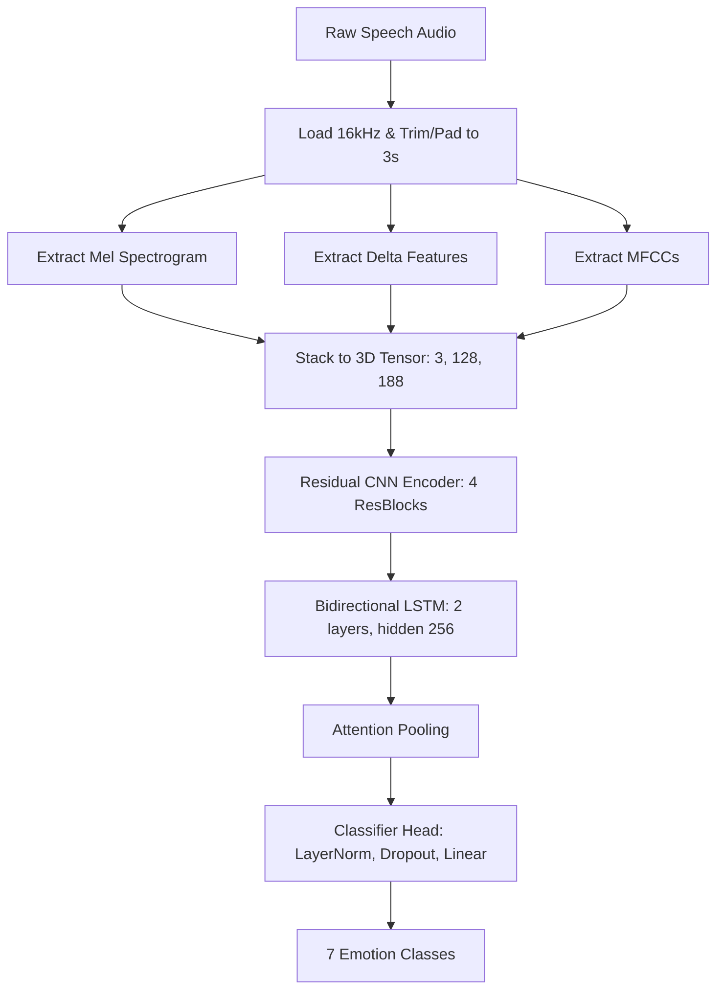

## Training Strategy
The model uses a **Speaker-Aware Adaptation** split strategy to ensure realistic evaluation across speakers.
- **Base Train Speaker**: All samples from `oaf` are used for training.
- **Target Speaker Adaptation**: A small portion (`ADAPT_RATIO = 0.05` / 5%) of the `yaf` speaker's data is included in the training set for adaptation.
- **Validation/Test**: The remaining target speaker data is split into validation (30%) and testing (70%).

The splits are explicitly saved to `models/speech_pipeline/train_split.csv`, `val_split.csv`, and `test_split.csv`.

**Training Hyperparameters:**
- **Optimizer**: `AdamW` (Learning Rate: 1e-4, Weight Decay: 1e-4)
- **Loss Function**: `CrossEntropyLoss` with label smoothing (0.03)
- **Batch Size**: 16
- **Epochs**: 40
- **Early Stopping**: Patience of 7 epochs based on Validation Macro F1.
- **Best Model Saving**: The model with the highest Validation Macro F1 is saved to `models/speech_pipeline/saved_models/best_model.pth`.

## Testing 
The testing and inference module is located in `test.py`.
* Running `python test.py` directly opens the CustomTkinter GUI. The GUI allows you to upload audio files, visualize predictions and confidence scores, and open tables for the classification report, confusion matrix, and metrics summary.
* Running `python test.py path/to/audio.wav` bypasses the GUI entirely and outputs the emotion prediction directly in the terminal (CLI prediction).

## Speech Pipeline Results

| Metric        |                  Value |
| ------------- | ---------------------: |
| Test Accuracy |                 99.89% |
| Test UAR      |                 99.89% |
| Test Macro F1 |                 99.89% |
| Model Name    | CNN_BiLSTM_Attention_MelDeltaMFCC |
| Architecture  | Mel Spectrogram + Delta + MFCC → CNN → BiLSTM → Attention → MLP |

## Speech Classification Report

| Emotion   | Precision | Recall | F1-score | Support |
| --------- | --------: | -----: | -------: | ------: |
| anger     |      1.00 |   0.99 |     1.00 |     133 |
| disgust   |      1.00 |   1.00 |     1.00 |     133 |
| fear      |      1.00 |   1.00 |     1.00 |     133 |
| happiness |      1.00 |   1.00 |     1.00 |     133 |
| neutral   |      1.00 |   1.00 |     1.00 |     133 |
| sadness   |      0.99 |   1.00 |     1.00 |     133 |
| surprise  |      1.00 |   1.00 |     1.00 |     133 |

## Speech Confusion Matrix

| Actual \ Predicted | anger | disgust | fear | happiness | neutral | sadness | surprise |
| ------------------ | ----: | ------: | ---: | --------: | ------: | ------: | -------: |
| anger              |   132 |       0 |    0 |         0 |       0 |       1 |        0 |
| disgust            |     0 |     133 |    0 |         0 |       0 |       0 |        0 |
| fear               |     0 |       0 |  133 |         0 |       0 |       0 |        0 |
| happiness          |     0 |       0 |    0 |       133 |       0 |       0 |        0 |
| neutral            |     0 |       0 |    0 |         0 |     133 |       0 |        0 |
| sadness            |     0 |       0 |    0 |         0 |       0 |     133 |        0 |
| surprise           |     0 |       0 |    0 |         0 |       0 |       0 |      133 |

## Speech Result Images

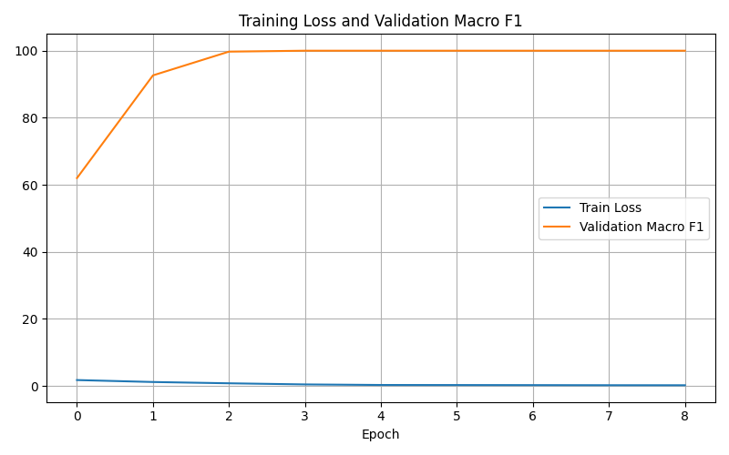

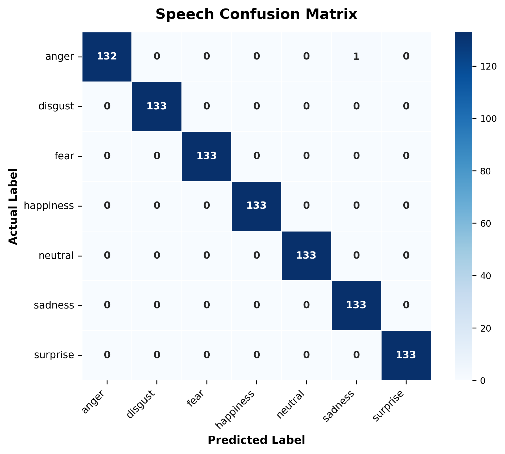

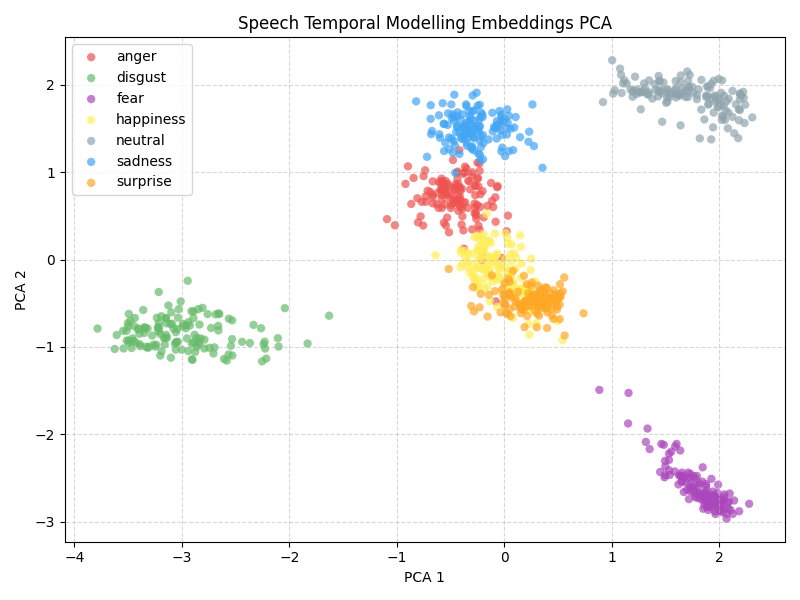

The PCA plot visualizes learned speech embeddings extracted from the temporal modelling block before the classifier. Clearer separation indicates stronger learned acoustic emotion representations.

## Speech Result Interpretation
The speech pipeline achieves near-perfect performance on the TESS test split, with a test accuracy of 99.89%, UAR of 99.89%, and Macro F1 of 99.89%. This indicates that acoustic information is highly discriminative for this dataset and that the extracted features (Mel Spectrogram, Delta, MFCC) coupled with the CNN-BiLSTM-Attention architecture are extremely effective.

The confusion matrix shows that almost all samples are correctly classified. The only error is a single `anger` sample predicted as `sadness`. The model has learned strong class separation for the controlled TESS recordings.

---

### Speaker-Independent (Zero-Shot) Speech Generalization Experiments

To evaluate the models' ability to generalize to unseen speakers under strict speaker-independent settings (zero-shot), additional speech SER experiments were performed by training on one speaker (e.g., OAF) and testing on the other (e.g., YAF) without any adaptation, or utilizing Group-Shuffle Splits. Below is a summary of these experiments compared to the main adapted speech pipeline:

| Experiment | Model Architecture | Split Strategy | Test Accuracy | Macro F1 | Key Acoustic Bottlenecks (Low Recall Classes) |
| :--- | :--- | :--- | :---: | :---: | :--- |
| **Main Adapted SER Model** | Mel/Delta/MFCC + CNN-BiLSTM-Attention | Speaker-Aware (5% YAF Adapt) | **99.89%** | **99.89%** | Strong performance under the speaker-aware adaptation setting. |
| **Custom CNN Zero-Shot** | Simple Sequential CNN (4 conv layers) | Speaker-Independent Zero-Shot | **77.57%** | **74.01%** | `happiness` (0.00% recall), `surprise` (75.00% recall), `disgust` (77.50% recall). |
| **Unified SER CNN GroupSplit 0.2** | Residual CNN (UnifiedSERModel) | GroupShuffleSplit (unseen speaker) | **66.11%** | **62.82%** | `happiness` (0.00% recall), `anger` (43.50% recall), `disgust` (76.65% recall). |
| **Strict Zero-Shot Baseline (t10)** | CNN-BiLSTM-Attention (UnifiedSERModel) | Speaker-Independent Zero-Shot | **61.43%** | **58.22%** | `happiness` (0.00% recall), `sadness` (44.50% recall), `anger` (40.50% recall). |
| **Wav2Vec2-base Zero-Shot** | Pre-trained Wav2Vec2 + Classifier Head | Speaker-Independent Zero-Shot | **62.64%** | **57.61%** | `happy` (9.00% recall), `sad` (20.50% recall), `disgust` (50.00% recall). |

#### Key Academic Observations

1. **Acoustic Arousal Confusion (Anger vs. Happiness)**:
   A major failure mode observed in both the Custom CNN zero-shot and the Unified SER CNN GroupSplit experiments is the complete inability to identify `happiness` (0.00% recall). The confusion matrices reveal that `happiness` samples are misclassified almost entirely as `anger` (e.g., in Custom CNN zero-shot, 197 out of 200 happy samples were predicted as angry). In speech acoustics, happiness and anger are both high-arousal emotions characterized by elevated pitch register, pitch range, and voice intensity. Without speaker-specific baseline adaptation, local CNNs struggle to separate valence (positive vs. negative) from arousal cues, resulting in severe class confusion.
2. **Pre-trained Representation Generalization Limits (Wav2Vec2)**:
   The zero-shot Wav2Vec2-base model achieved an accuracy of only 62.64% (Macro F1 of 57.61%). Despite containing deep self-supervised contextualized speech representations, Wav2Vec2-base struggled significantly with `happy` (9.00% recall, confused with `fear` and `angry`) and `sad` (20.50% recall, confused with `neutral` due to similar low-intensity acoustic profiles). This indicates that raw pre-trained transformer features, without task-specific fine-tuning or speaker-specific calibration, contain high speaker and phonetic variability that degrades speaker-independent emotion classification boundaries.
3. **Valence and Intensity Bottlenecks**:
   The classes that consistently reduced the overall accuracy across all zero-shot/speaker-independent experiments were `happy/happiness`, `sad/sadness`, and `disgust`. Low-intensity emotions (sadness) were frequently misclassified as `neutral` (e.g., in Wav2Vec2-base, 120 out of 200 sad samples were predicted as neutral), while high-arousal emotions (happiness) were misclassified as other high-arousal emotions (anger or fear). This suggests that speaker-independent models are highly sensitive to vocal intensity thresholds and require adaptation or acoustic normalization (e.g., instance normalization) to build robust emotion-specific boundaries.

---

# Text Emotion Recognition Pipeline

## Purpose
This pipeline predicts emotion from text only. It is designed to test whether the spoken word content extracted from the TESS filenames contains enough semantic information to identify emotion without using the audio signal.

## Input
The input is text extracted from TESS audio filenames.
Example: `OAF_back_angry.wav` is parsed and converted to `back`.
The extracted word is used as the text input, and the emotion label is extracted from the folder name.

## Preprocessing
The `preprocess.py` script scans the TESS dataset directory and creates a text-focused `metadata.csv`.
The script extracts: `file_path`, `text` (spoken word), `emotion` (standardized), `speaker_id`, `raw_emotion`, `original_folder`, `original_file`, and `dataset` (TESS).

The preprocessing script maps raw emotion labels into seven standard classes:
* `angry` → `anger`
* `disgust` → `disgust`
* `fear` → `fear`
* `happy` → `happiness`
* `neutral` → `neutral`
* `sad` → `sadness`
* `pleasant_surprise` / `pleasant_surprised` / `pleasant` / `surprise` / `ps` → `surprise`

## Model Architecture
The text pipeline is based on DistilBERT (`distilbert-base-uncased`):

| Component | Description |
|---|---|
| Tokenizer | Pretrained DistilBERT tokenizer |
| Transformer Encoder | DistilBERT transformer encoder |
| Text Representation | CLS token pooling (`outputs.last_hidden_state[:, 0, :]`) |
| Classifier | MLP classification head: `Dropout(0.3) -> Linear(768, 256) -> ReLU -> Dropout(0.3) -> Linear(256, 7)` |

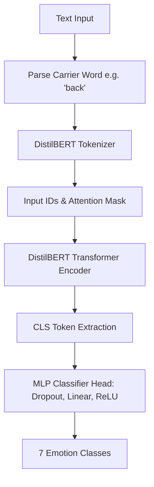

## Training Method
The `train.py` script trains the DistilBERT-based text emotion classifier using a speaker-aware split strategy:
* **Base train speaker**: `oaf`
* **Target speaker**: `yaf` (5% adaptation ratio in training, remaining target speaker data is split 30/70 for validation and test)
* **Hyperparameters**: Batch size `16`, Epochs `20`, Learning rate `2e-5`, Optimizer `AdamW`, Loss function `CrossEntropyLoss` with label smoothing `0.03`, Weight decay `1e-4`, Early stopping patience `5`, Seed `42`.

## Testing and Inference Method
The GUI prediction functionality is implemented inside `test.py`.
Running `python test.py` opens the CustomTkinter GUI to test the model manually by typing in words.

---

## Text Pipeline Results

| Metric                   |                     Value |
| ------------------------ | ------------------------: |
| Test Accuracy            |                    14.93% |
| Test UAR                 |                    14.93% |
| Test Macro F1            |                     7.29% |
| Best Epoch               |                         5 |
| Best Validation Macro F1 |                     6.18% |
| Model Name               | `distilbert-base-uncased` |

## Text Classification Report

| Emotion      | Precision | Recall | F1-score | Support |
| ------------ | --------: | -----: | -------: | ------: |
| anger        |      0.15 |   0.68 |     0.24 |     133 |
| disgust      |      0.15 |   0.32 |     0.21 |     133 |
| fear         |      0.14 |   0.04 |     0.06 |     133 |
| happiness    |      0.00 |   0.00 |     0.00 |     133 |
| neutral      |      0.00 |   0.00 |     0.00 |     133 |
| sadness      |      0.00 |   0.00 |     0.00 |     133 |
| surprise     |      0.00 |   0.00 |     0.00 |     133 |

## Text Confusion Matrix

| Actual \ Predicted | anger | disgust | fear | happiness | neutral | sadness | surprise |
| ------------------ | ----: | ------: | ---: | --------: | ------: | ------: | -------: |
| anger              |    91 |      37 |    5 |         0 |       0 |       0 |        0 |
| disgust            |    85 |      43 |    5 |         0 |       0 |       0 |        0 |
| fear               |    90 |      38 |    5 |         0 |       0 |       0 |        0 |
| happiness          |    85 |      43 |    5 |         0 |       0 |       0 |        0 |
| neutral            |    88 |      40 |    5 |         0 |       0 |       0 |        0 |
| sadness            |    88 |      40 |    5 |         0 |       0 |       0 |        0 |
| surprise           |    86 |      40 |    7 |         0 |       0 |       0 |        0 |

## Text Result Images

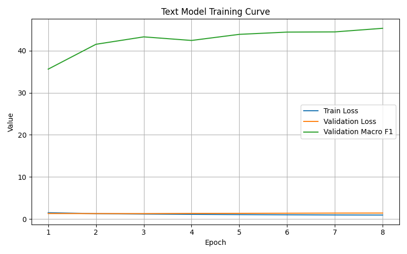


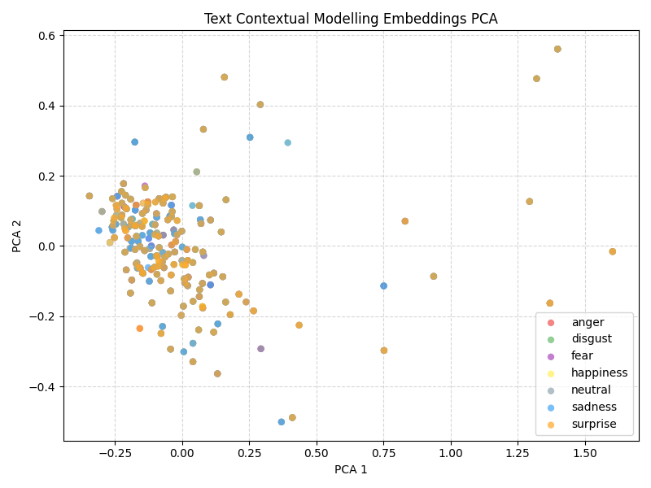

The PCA plot visualizes learned text embeddings extracted from the contextual modelling block before the classifier. Because TESS text contains mostly short neutral words, overlapping clusters are expected and support the finding that the text modality is weak for this dataset.

## Text Result Interpretation
The text pipeline performs poorly on the TESS dataset.
The test accuracy is 14.93%, while random chance for seven balanced classes is approximately 14.28%. This means the model is performing almost at random-chance level.
The Macro F1-score is only 7.29%, which confirms that the model is not learning meaningful class separation across all seven emotion categories.

The confusion matrix shows that the model predicts mostly `anger`, `disgust`, and a small number of `fear` samples. It completely fails to predict `happiness`, `neutral`, `sadness`, and `surprise`.

**Why Performance Is Low When TESS Is Used for Text:**
TESS is designed for speech emotion recognition, not natural-language emotion recognition.
The text extracted from filenames is only a short neutral target word (e.g. `back`, `goose`, `ditch`, `bar`). These words do not carry emotional meaning by themselves. The emotion exists in the way the word is spoken, not in the word itself.

Because the same input text maps to multiple different labels, the text-only model receives contradictory training signals during training. DistilBERT cannot reliably infer emotion when the semantic input is identical across classes.

---

# DailyDialog Text-Only Pipeline (Supporting Experiment)

DailyDialog was added as a supporting text-only experiment because the TESS text pipeline has a structural limitation (identical carrier words across classes). To evaluate text-only emotion recognition on natural conversational text, a supporting DailyDialog text pipeline was implemented in `models/text_pipeline_DailyDialog/`.

## Preprocessing
The `preprocess.py` parses `dialogues_text.txt` and `dialogues_emotion.txt` in the `data/` folder, cleans text utterances, maps labels, and generates `metadata.csv` containing train/val/test splits.

## Model Architecture
The DailyDialog model is based on `roberta-base`. It extracts context embeddings using RoBERTa's CLS token and feeds them to an MLP classifier. Extreme class imbalance is handled using a PyTorch `WeightedRandomSampler` during data loading.

## DailyDialog Text Results

| Metric | Value |
|---|---:|
| Test Accuracy | 77.34% |
| Test UAR | 59.31% |
| Test Macro F1 | 46.49% |
| Test Weighted F1 | 79.93% |
| Pretrained Encoder | `roberta-base` |

## DailyDialog Interpretation
The DailyDialog result shows that the transformer architecture performs significantly better (77.34% accuracy) when the input text contains meaningful conversational semantics, confirming that the poor TESS text result (14.93%) is due to the dataset's neutral target words rather than a limitation of the model itself.

---

# Multimodal Fusion Pipeline

## Purpose
This pipeline combines acoustic speech representation and text representation to generate a unified emotion prediction. The objective is to evaluate whether multimodal fusion improves emotion recognition compared with using speech or text independently.

## Input
* 16 kHz audio waveform.
* Literal text transcript.

## Model Architecture
The fusion pipeline combines two independent branches:

| Component | Description |
| --- | --- |
| Speech Branch | Mel Spectrogram + Delta + MFCC features → CNN (3 Conv Blocks: `3 -> 32 -> 64 -> 128`) → BiLSTM (2-layer, `hidden_size=128`, output `256`) → Attention Pooling |
| Text Branch | DistilBERT transformer encoder with CLS token pooling |
| Speech Projection | `nn.Linear(256, 256) -> nn.ReLU() -> nn.Dropout(0.3)` |
| Text Projection | `nn.Linear(768, 256) -> nn.ReLU() -> nn.Dropout(0.2)` |
| Fusion Method | Concatenation of speech and text representations (`256 + 256 = 512`) |
| Fusion Projection | `nn.Linear(512, 256) -> nn.BatchNorm1d(256) -> nn.ReLU() -> nn.Dropout(0.3)` |
| Classifier | `nn.Linear(256, 128) -> nn.ReLU() -> nn.Dropout(0.3) -> nn.Linear(128, 7)` |

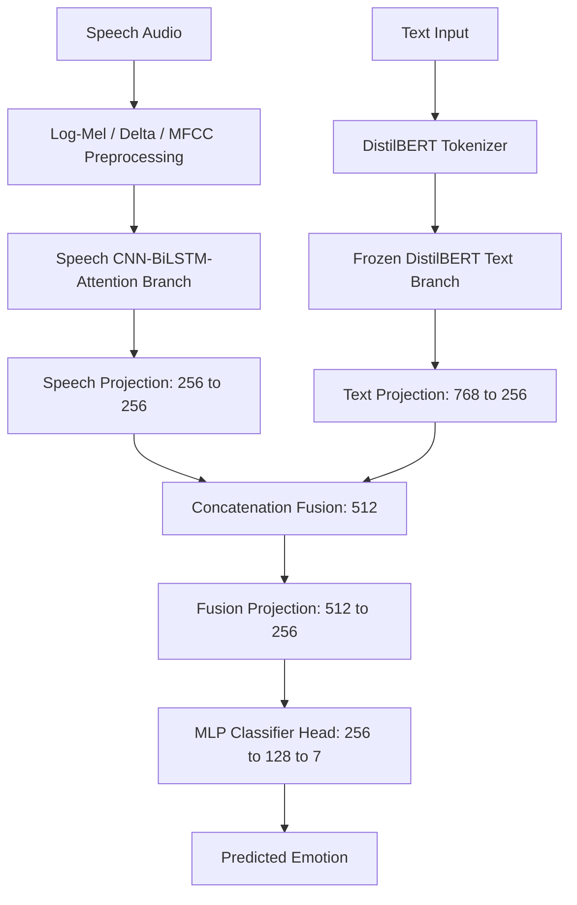

## Preprocessing
* Constructs a dual-purpose `metadata.csv` containing both audio `file_path` and extracted `text`.
* Processes audio features identically to the speech pipeline (Mel Spectrogram, Delta, MFCC).
* Tokenizes text using the DistilBERT tokenizer.

## Training Method
The `train.py` script trains the dual-branch fusion model with speaker-aware adaptation:
* **Base Train Speaker**: `oaf`
* **Target Speaker**: `yaf` (5% adaptation ratio)
* **Hyperparameters**: Batch size `16`, Epochs `30`, Patience `5`, Learning rate `2e-5`, Weight decay `1e-4`, Optimizer `AdamW`, Loss function `CrossEntropyLoss`, Seed `42`.
* **Modality Constraints**: The text branch (DistilBERT) is kept frozen during training to prevent overfitting on the semantically weak TESS carrier words, while the speech branch and projection/classifier heads are trained.

## Testing Method
The `test.py` script loads the trained fusion model and provides both GUI and CLI interfaces.
Running `python test.py` opens the CustomTkinter GUI. The GUI allows uploading audio, writing a transcript, performing joint inference, and displaying plots and reports.

---

## Fusion Pipeline Results

| Metric | Value |
|---|---:|
| Test Accuracy | 98.60% |
| Test UAR | 98.60% |
| Test Macro F1 | 98.61% |
| Best Epoch | 18 |
| Model Architecture | CNN-BiLSTM-Attention + DistilBERT + Concatenation + MLP |

## Fusion Classification Report

| Emotion | Precision | Recall | F1-score | Support |
|---|---:|---:|---:|---:|
| anger | 1.0000 | 0.9624 | 0.9808 | 133 |
| disgust | 0.9923 | 0.9699 | 0.9810 | 133 |
| fear | 0.9924 | 0.9774 | 0.9848 | 133 |
| happiness | 0.9635 | 0.9925 | 0.9778 | 133 |
| neutral | 1.0000 | 1.0000 | 1.0000 | 133 |
| sadness | 1.0000 | 1.0000 | 1.0000 | 133 |
| surprise | 0.9568 | 1.0000 | 0.9779 | 133 |

## Fusion Confusion Matrix

| Actual \ Predicted | anger | disgust | fear | happiness | neutral | sadness | surprise |
|---|---:|---:|---:|---:|---:|---:|---:|
| anger | 128 | 1 | 0 | 2 | 0 | 0 | 2 |
| disgust | 0 | 129 | 0 | 0 | 0 | 0 | 4 |
| fear | 0 | 0 | 130 | 3 | 0 | 0 | 0 |
| happiness | 0 | 1 | 0 | 132 | 0 | 0 | 0 |
| neutral | 0 | 0 | 0 | 0 | 133 | 0 | 0 |
| sadness | 0 | 0 | 0 | 0 | 0 | 133 | 0 |
| surprise | 0 | 0 | 0 | 0 | 0 | 0 | 133 |

## Fusion Result Images
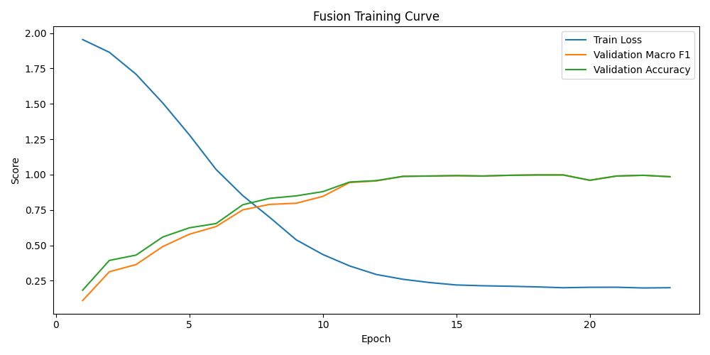


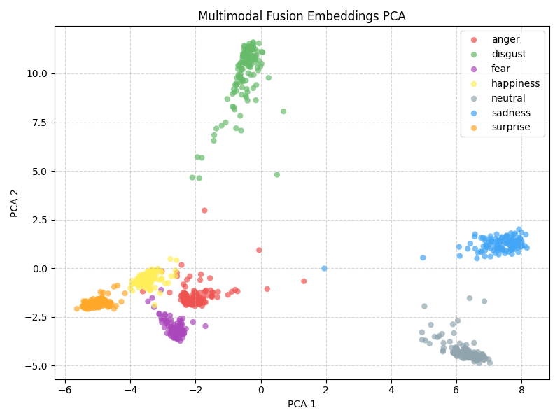

The PCA plot visualizes fused speech-text embeddings extracted after concatenation and before the classifier. The visualization helps show how the multimodal model organizes emotion classes in the learned representation space.

## Fusion Result Interpretation
The fusion pipeline achieves 98.60% accuracy by combining speech and text representations through concatenation and an MLP classifier.

**Key Findings:**
1. **Speech-Driven Performance**: The speech branch (CNN-BiLSTM-Attention with Mel Spectrogram, Delta, MFCC) remains the dominant contributor to fusion performance. The acoustic features capture clear emotional cues from TESS's acted recordings.
2. **Weak Text Contribution**: The text component extracted from TESS filenames (single neutral words like "back", "ditch", "goose") provides minimal emotional signal. Text is semantically identical across all emotion classes, so it contributes little to the decision boundary.
3. **Cross-Modal Asymmetry**: The fusion model demonstrates that when one modality is weak (text in TESS), multimodal fusion performs close to the strong modality (speech) alone. In fact, fusing the weak textual modality adds a small amount of noise, causing accuracy to drop slightly from the speech-only baseline (99.89% to 98.60%).

---

# MELD Multimodal Fusion Pipeline (Supporting Experiment)

MELD was added as a supporting multimodal fusion experiment because TESS has limited text semantics. MELD provides aligned audio and text from realistic multi-speaker dialogue.

## Preprocessing
The `preprocess.py` processes MELD CSV files (`dataset1`) and video splits, extracts acoustic features, aligns them with text utterances, and writes train/dev/test splits in `metadata.csv`.

## Model Architecture
The MELD fusion model is implemented in `models/fusion_pipeline_MELD/`:

| Component | Description |
| --- | --- |
| Speech Branch | CNN-BiLSTM-Attention acoustic encoder (`3 -> 32 -> 64 -> 128` channels, hidden LSTM size `128`) |
| Text Branch | DistilBERT (`distilbert-base-uncased`) with parameters frozen for the first epoch, then jointly fine-tuned |
| Fusion Method | Concatenation of speech and text projections (`256` speech + `256` text = `512` fused embedding) |
| Classifier | MLP classifier head: `512 -> 256 -> 128 -> 7` |
| Loss Function | Class-weighted Cross-Entropy Loss to handle extreme class imbalance |

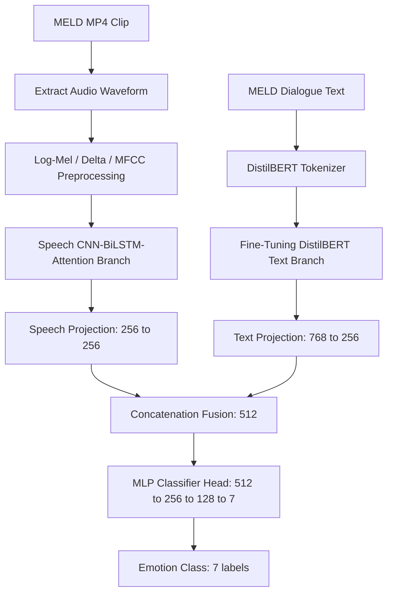

## MELD Fusion Results

| Metric | Value |
|---|---:|
| Test Accuracy | 59.50% |
| Test UAR | 42.23% |
| Test Macro F1 | 41.36% |
| Test Weighted F1 | 59.91% |

## MELD Interpretation
The MELD result is lower than the TESS result because MELD is a much more realistic and challenging benchmark. It features over 300 speakers, spontaneous dialogue with background noise, varied audio lengths, overlapping speech, and severe class imbalance (predominantly neutral/joy vs. fear/disgust). This provides a more realistic estimate of multimodal emotion recognition performance.

---

## Final Comparison Table

| Pipeline | Dataset | Modality | Architecture | Accuracy | UAR | Macro F1 | Primary Observation |
|---|---|---|---|---:|---:|---:|---|
| **Speech Pipeline** | TESS | Audio | Mel/Delta/MFCC + CNN-BiLSTM-Attention | 99.89% | 99.89% | 99.89% | Strongest core pipeline; TESS speech contains clear acoustic emotion cues. |
| **Text Pipeline** | TESS | Text | DistilBERT | 14.93% | 14.93% | 7.29% | Performs near random chance because TESS text is semantically weak and repeating. |
| **Fusion Pipeline** | TESS | Audio + Text | CNN-BiLSTM-Attention + DistilBERT | 98.60% | 98.60% | 98.61% | Strong performance, but slightly lower than speech-only because weak text adds noise. |
| **Supporting Text** | DailyDialog | Text | RoBERTa-base | 77.34% | 59.31% | 46.49% | Confirms text models work well when conversational semantics contain emotional cues. |
| **Supporting Fusion** | MELD | Audio + Text | CNN-BiLSTM-Attention + DistilBERT | 59.50% | 42.23% | 41.36% | Realistic benchmark demonstrating performance limits on noisy, imbalanced dialogue. |

---

## Result Visualizations

### Speech Pipeline Visualizations
<table>
  <tr>
    <td align="center">
      <br>
      <b>Training Curve</b>
    </td>
    <td align="center">
      <br>
      <b>Confusion Matrix</b>
    </td>
    <td align="center">
      <br>
      <b>Speech Embeddings PCA</b>
    </td>
  </tr>
</table>

<p align="center">
  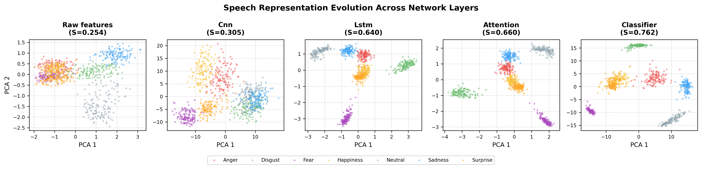
  <br>
  <i>Figure 1: Representations evolution of Speech Pipeline.</i>
</p>

### Text Pipeline Visualizations
<table>
  <tr>
    <td align="center">
      <br>
      <b>Training Curve</b>
    </td>
    <td align="center">
      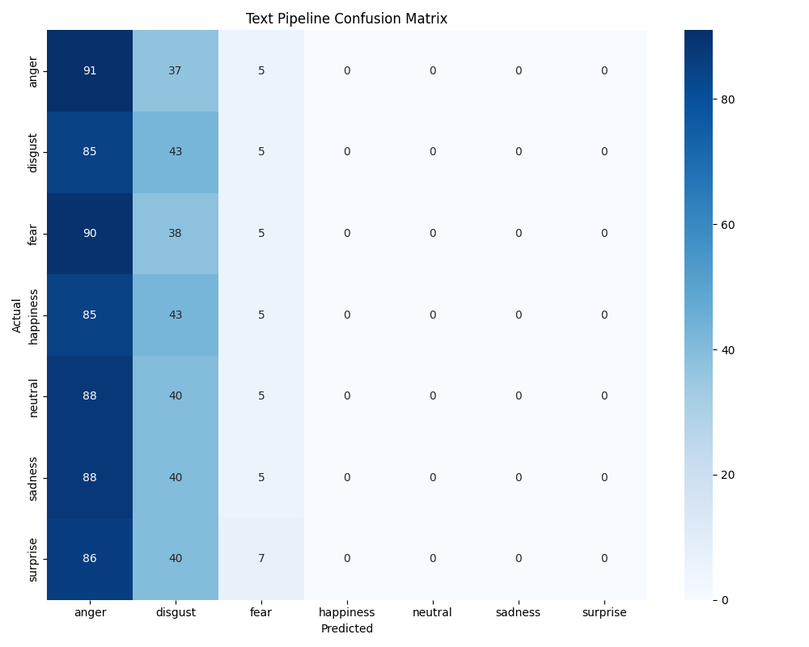<br>
      <b>Confusion Matrix</b>
    </td>
    <td align="center">
      <br>
      <b>Text Embeddings PCA</b>
    </td>
  </tr>
</table>

<p align="center">
  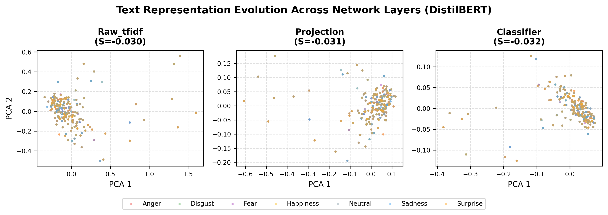
  <br>
  <i>Figure 2: Representations evolution of Text Pipeline.</i>
</p>

### Fusion Pipeline Visualizations
<table>
  <tr>
    <td align="center">
      <br>
      <b>Training Curve</b>
    </td>
    <td align="center">
      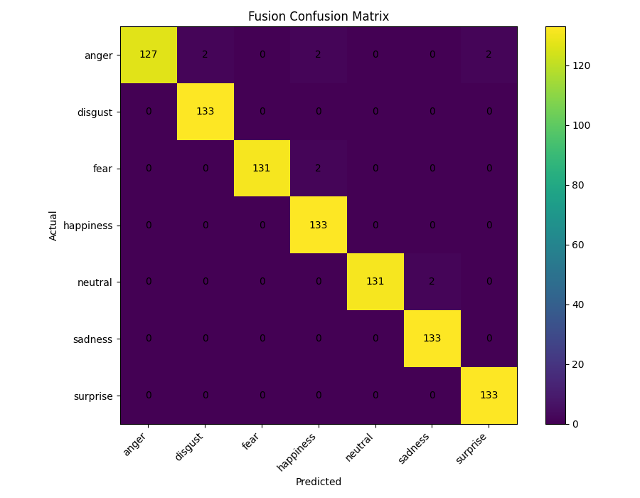<br>
      <b>Confusion Matrix</b>
    </td>
    <td align="center">
      <br>
      <b>Fusion Embeddings PCA</b>
    </td>
  </tr>
</table>
  <p align="center">
  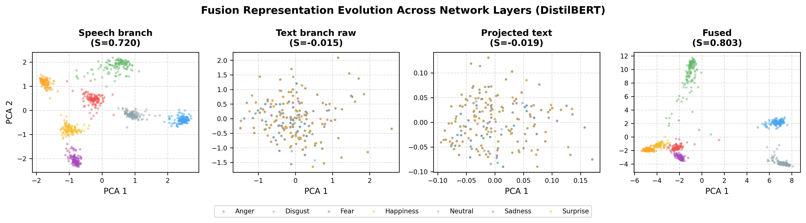
  <br>
  <i>Figure 3: Representations evolution of Fusion Pipeline.</i>
</p>  

### Supporting Experiment Visualizations
* **DailyDialog Confusion Matrix**: Located at `results/text_pipeline_DailyDialog/plots/confusion_matrix.png`
* **MELD Fusion Confusion Matrix**: Located at `results/fusion_pipeline_MELD/plots/confusion_matrix.png`

---

## Evaluation Metrics
* **Accuracy:** Overall percentage of correct emotion classifications.
* **Precision:** Calculates how many of the positively predicted instances actually belonged to the class.
* **Recall:** Calculates how many actual positives the model successfully captured.
* **F1-score:** Harmonic mean of precision and recall.
* **Macro F1:** An unweighted mean of all per-class F1-scores, heavily utilized because it does not skew for class imbalance.
* **UAR (Unweighted Average Recall):** Used heavily in Speech Emotion Recognition to accurately judge cross-class generalization.
* **Confusion matrix:** A tabular matrix showing exactly which classes are confused/mispredicted against their true label.

---

## Limitations

1. **Limited Speaker Coverage**: TESS contains only two female speakers (OAF and YAF). Generalization to male voices, different ages, and accents is completely untested.
2. **Controlled Acoustic Environment**: TESS is recorded in a noiseless studio with professional audio equipment. Real-world audio contains background noise, microphone degradation, room reverberation, and acoustic variation.
3. **Acted vs. Spontaneous**: TESS features acted emotions performed by trained speakers. Spontaneous emotions in natural conversation exhibit different acoustic patterns and temporal dynamics.
4. **Weak Text Modality**: Emotion is encoded in TESS filename words (single neutral words like "back", "ditch", "goose") that repeat identically across all emotion classes. This creates a fundamental data limitation for text-only emotion recognition.
5. **Speech-Dominated Fusion**: The fusion model is heavily speech-dominated because TESS text is inherently weak. On datasets with meaningful text (e.g., social media, customer reviews) and diverse speakers, multimodal fusion would show more balanced contributions.
6. **No Cross-Dataset Validation**: The models are trained and tested exclusively on TESS. Performance on other speech emotion datasets (RAVDESS, CREMA-D, IEMOCAP, SAVEE) is unknown.
7. **Single Language**: All experiments use English. Generalization to other languages is not evaluated.
8. **Pre-trained Model Constraints**: DistilBERT is trained on English Wikipedia and book text, not emotion-specific corpora. Fine-tuning on weak TESS text limits the text branch performance.

---

## Future Improvements
1. **Multi-Dataset Evaluation**: Extend experiments to RAVDESS, CREMA-D, IEMOCAP, and SAVEE to assess cross-dataset generalization and identify domain-specific biases.
2. **ASR Transcript Generation**: Replace TESS filename words with transcripts generated via Automatic Speech Recognition (ASR) tools (e.g. Whisper) to capture natural speech details.
3. **Advanced Transformer Encoders**: Explore WavLM or HuBERT for speech feature extraction to benchmark against the current CNN-BiLSTM-Attention approach.
4. **Robust Audio Augmentation**: Incorporate white noise, background chatter, microphone degradation, and room reverberation to improve model robustness in noisy real-world environments.
5. **Gated Fusion & Attention Mechanisms**: Design advanced fusion layers, such as gated cross-modal attention, to dynamically learn which modality to trust based on input noise levels.
6. **Continuous Valence-Arousal Regression**: Move beyond discrete 7-class classification to continuous emotion regression inside the valence-arousal space.

---

## Conclusion

This project comprehensively implements and evaluates three emotion recognition pipelines: speech-only, text-only, and multimodal fusion, along with two supporting experiments on DailyDialog and MELD. The experiments reveal fundamental insights about the TESS dataset and multimodal emotion recognition:

* **Speech Emotion Recognition (99.89% Accuracy)**: Acoustic features (Mel Spectrogram, Delta, MFCC) with CNN-BiLSTM-Attention achieve near-perfect classification on controlled, studio-recorded datasets containing strong vocal emotion cues.
* **Text Emotion Recognition (14.93% Accuracy)**: Text-only approaches fail when the text is composed of neutral carrier words that repeat across classes. However, when evaluated on conversational sentences containing emotional semantics (DailyDialog), accuracy increases to **77.34%**, demonstrating that the limitation is dataset-specific.
* **Multimodal Fusion (98.60% Accuracy)**: Fusing representations is only effective when both modalities carry predictive signals. Fusing the weak TESS text modality adds minor representation noise, slightly degrading performance compared to using the speech modality alone. When evaluated on realistic noisy dialogue data (MELD), the fusion pipeline achieves a balanced benchmark of **59.50%**.

The project successfully demonstrates a complete machine learning pipeline for emotion recognition, from data preprocessing through model training, evaluation, and inference.

---

## License

This project is intended for academic and research purposes.
