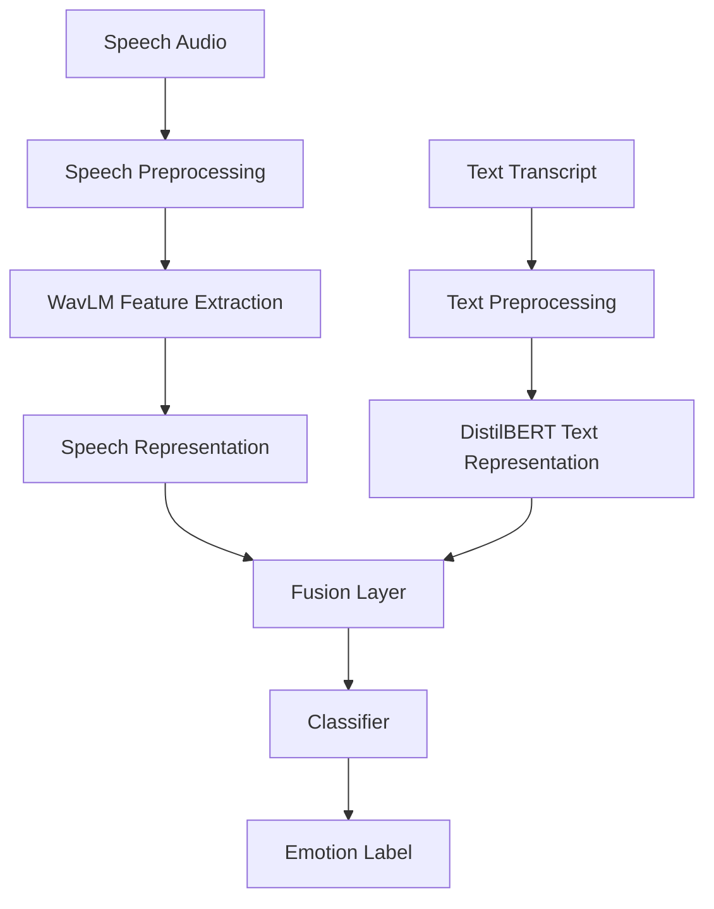

# Multimodal Emotion Recognition

This project performs emotion recognition using independent and combined machine learning pipelines focusing on speech, text, and multimodal fusion. 

The dataset utilized is the **Toronto Emotional Speech Set (TESS)**. The core objective of this project is to robustly compare unimodal methods (processing acoustic properties or semantic transcripts individually) against an advanced multimodal method. 

The capstone of the project is the fusion model, which dynamically combines the rich acoustic representations of **WavLM** with the contextual text representations of **DistilBERT** to predict the user's emotional state.

## Table of Contents

1. [Project Objective](#project-objective)
2. [Dataset — TESS](#dataset--tess)
3. [Overall Architecture](#overall-architecture)
4. [Complete Project Folder Structure](#complete-project-folder-structure)
5. [Speech Emotion Recognition Pipeline](#speech-emotion-recognition-pipeline)
6. [Text Emotion Recognition Pipeline](#text-emotion-recognition-pipeline)
7. [Multimodal Fusion Emotion Recognition Pipeline](#multimodal-fusion-emotion-recognition-pipeline)
8. [Final Comparison Table](#final-comparison-table)
9. [Result Visualizations](#result-visualizations)
10. [Evaluation Metrics](#evaluation-metrics)
11. [Limitations](#limitations)
12. [Future Improvements](#future-improvements)
13. [Conclusion](#conclusion)

---

## Project Objective

The goal of the project is to classify emotional states from speech and textual data. 

The system categorizes input into one of seven distinct emotion classes:
- anger
- disgust
- fear
- happiness
- neutral
- sadness
- surprise

The project fundamentally compares speech, text, and fusion methods to isolate which data modality provides the richest emotional signal and to observe if a multimodal fusion strategy successfully leverages both modalities simultaneously.

---

## Dataset — TESS

The primary dataset is the **Toronto Emotional Speech Set (TESS)**.
- It contains acted emotional speech recordings.
- It features two female speakers: OAF and YAF.
- Audio files are organized precisely by speaker and emotion folders.
- Emotion labels are extracted programmatically from the parent folder names.
- Transcript text is extracted by parsing the raw audio filenames (e.g., `OAF_back_angry.wav` extracts the word `back`).

**Important Note on Modality Strength**: TESS is incredibly strong for speech emotion recognition because the actors clearly vocally project the emotions. However, TESS is inherently weak for text emotion recognition because the spoken words are emotionally neutral target words (such as "bar", "ditch", "jar") that repeat identically across every emotional state.

### TESS Folder Structure
```text
dataset/
├── OAF_angry/
├── OAF_disgust/
├── OAF_Fear/
├── OAF_happy/
├── OAF_neutral/
├── OAF_Pleasant_surprise/
├── OAF_Sad/
├── YAF_angry/
├── YAF_disgust/
├── YAF_fear/
├── YAF_happy/
├── YAF_neutral/
├── YAF_pleasant_surprised/
└── YAF_sad/
```

---

## Overall Architecture



The architecture utilizes independent processing branches. Audio is handled via WavLM to extract acoustic features like pitch and tone. Text is tokenized and processed by DistilBERT to capture semantics. The fusion layer concatenates these representations and feeds them into an MLP Classifier to generate the final emotion label.

---

## Complete Project Folder Structure

```text
Multimodal Emotion Recognition/
├── dataset/
│   ├── OAF_angry/
│   └── (remaining emotion folders)
│
├── models/
│   ├── speech_pipeline/
│   │   ├── preprocess.py
│   │   ├── train.py
│   │   ├── test.py
│   │   ├── app.py
│   │   ├── metadata.csv
│   │   ├── train_split.csv
│   │   ├── val_split.csv
│   │   ├── test_split.csv
│   │   └── saved_models/
│   │       ├── best_model.pth
│   │       └── model_config.json
│   │
│   ├── text_pipeline/
│   │   ├── preprocess.py
│   │   ├── train.py
│   │   ├── test.py
│   │   ├── app.py
│   │   ├── metadata.csv
│   │   ├── train_split.csv
│   │   ├── val_split.csv
│   │   ├── test_split.csv
│   │   └── saved_models/
│   │       ├── best_model.pth
│   │       ├── model_config.json
│   │       ├── tokenizer_config.json
│   │       ├── tokenizer.json
│   │       ├── special_tokens_map.json
│   │       └── vocab.txt
│   │
│   └── fusion_pipeline/
│       ├── preprocess.py
│       ├── train.py
│       ├── test.py
│       ├── app.py
│       ├── metadata.csv
│       ├── train_split.csv
│       ├── val_split.csv
│       ├── test_split.csv
│       └── saved_models/
│           ├── best_model.pth
│           ├── model_config.json
│           ├── tokenizer_config.json
│           ├── tokenizer.json
│           ├── special_tokens_map.json
│           └── vocab.txt
│
├── results/
│   ├── speech_pipeline/
│   │   ├── metrics/
│   │   │   └── speech_metrics.json
│   │   ├── plots/
│   │   │   ├── confusion_matrix.png
│   │   │   └── training_curve.png
│   │   └── results/
│   │       ├── classification_report.csv
│   │       ├── classification_report.txt
│   │       ├── confusion_matrix.csv
│   │       └── summary.csv
│   │
│   ├── text_pipeline/
│   │   ├── metrics/
│   │   │   └── text_metrics.json
│   │   ├── plots/
│   │   │   ├── confusion_matrix.png
│   │   │   └── training_curve.png
│   │   └── results/
│   │       ├── classification_report.csv
│   │       ├── classification_report.txt
│   │       ├── confusion_matrix.csv
│   │       └── summary.csv
│   │
│   └── fusion_pipeline/
│       ├── metrics/
│       │   ├── fusion_metrics.json
│       │   └── training_metrics.csv
│       ├── plots/
│       │   ├── confusion_matrix.png
│       │   ├── confusion_matrix_test.png
│       │   └── training_curve.png
│       └── results/
│           ├── classification_report.csv
│           ├── classification_report.txt
│           ├── confusion_matrix.csv
│           └── summary.csv
│
└── README.md
```

---

# Speech Emotion Recognition Pipeline

## Purpose
This pipeline predicts emotion from audio only, isolating the effect of acoustic and prosodic signals.

## Input
Raw `.wav` audio files at 16 kHz from the TESS dataset.

## Model Used
* microsoft/wavlm-base
* MLP classifier head

## Preprocessing
* Scans the dataset directory.
* Extracts emotion labels directly from folder names.
* Extracts speaker ID from the prefix.
* Generates `metadata.csv`.
* Audio is loaded via librosa, resampled to 16 kHz, trimmed for silence, and padded/truncated to a strict 3-second window.
* Augmentation applied during training (noise, volume, pitch shifting).

## Training Method
* Utilizes a strict speaker-aware split strategy: OAF is used as the base train speaker, and YAF is held out for testing (with a minor 5% adaptation ratio injected).
* Optimizer: AdamW
* Loss Function: CrossEntropyLoss
* Batch size: 16
* Epochs: 30
* Early stopping based on validation Macro F1.
* Output model is saved to `saved_models/best_model.pth`.

## Testing Method
* `test.py` initializes the model architecture and loads `best_model.pth`.
* It evaluates exclusively on `test_split.csv`.
* Generates comprehensive metrics: classification reports, confusion matrix tables, and JSON summaries.

## GUI / App Usage
* `app.py` spins up a CustomTkinter graphical interface.
* Accepts direct audio upload or live microphone recording.
* Generates live prediction confidences.
* Provides interface buttons to view plots, reports, and matrices interactively.

## How to Run Speech Pipeline
```powershell
cd "models\speech_pipeline"
python preprocess.py
python train.py
python test.py
python app.py
```
* `preprocess.py` creates the required dataset metadata mappings.
* `train.py` handles the main training loop and serialization of best weights.
* `test.py` strictly evaluates the saved weights on unseen data.
* `app.py` boots the interactive GUI dashboard.

## Speech Pipeline Generated Files

| File/Folder | Created By | Purpose |
|---|---|---|
| metadata.csv | preprocess.py | Stores audio paths, emotion labels, speaker IDs |
| train_split.csv | train.py | Training split data |
| val_split.csv | train.py | Validation split data |
| test_split.csv | train.py | Test split data |
| saved_models/ | train.py | Stores trained model weights (`best_model.pth`) and config |
| results/speech_pipeline/metrics/ | train.py/test.py | Stores JSON metrics |
| results/speech_pipeline/plots/ | train.py/test.py | Stores training convergence and confusion matrix images |
| results/speech_pipeline/results/ | test.py/train.py | Stores CSV reports, summary, and confusion matrix tables |

## Speech Pipeline Results

| Metric | Value |
|---|---:|
| Test Accuracy | 99.89% |
| Test UAR | 99.89% |
| Test Macro F1 | 99.89% |
| Model Name | microsoft/wavlm-base |

## Speech Classification Report

| Emotion | Precision | Recall | F1-score | Support |
|---|---:|---:|---:|---:|
| anger | 1.00 | 1.00 | 1.00 | 133 |
| disgust | 1.00 | 0.99 | 1.00 | 133 |
| fear | 1.00 | 1.00 | 1.00 | 133 |
| happiness | 1.00 | 1.00 | 1.00 | 133 |
| neutral | 1.00 | 1.00 | 1.00 | 133 |
| sadness | 1.00 | 1.00 | 1.00 | 133 |
| surprise | 0.99 | 1.00 | 1.00 | 133 |

## Speech Confusion Matrix

| Actual \ Predicted | anger | disgust | fear | happiness | neutral | sadness | surprise |
|---|---:|---:|---:|---:|---:|---:|---:|
| anger | 133 | 0 | 0 | 0 | 0 | 0 | 0 |
| disgust | 0 | 132 | 0 | 0 | 0 | 0 | 1 |
| fear | 0 | 0 | 133 | 0 | 0 | 0 | 0 |
| happiness | 0 | 0 | 0 | 133 | 0 | 0 | 0 |
| neutral | 0 | 0 | 0 | 0 | 133 | 0 | 0 |
| sadness | 0 | 0 | 0 | 0 | 0 | 133 | 0 |
| surprise | 0 | 0 | 0 | 0 | 0 | 0 | 133 |

## Speech Result Images


## Speech Result Interpretation
* The metrics show near-perfect performance (99.89%).
* Speech works incredibly well for TESS because the emotional signal is vividly present in the vocal tone, pitch, and prosody.
* The confusion matrix indicates exactly one misclassified sample (Disgust predicted as Surprise).
* Speech is highly dominant because WavLM's robust pre-training efficiently clusters the acoustic variance of the acted performances.
* **Limitations:** The model operates on entirely clean, high-fidelity studio recordings with only two actors. It is highly likely over-fitted to these specific vocal traits and lacks real-world noise resilience.

---

# Text Emotion Recognition Pipeline

## Purpose
This pipeline predicts emotion purely from semantic text alone, completely ignoring acoustic audio.

## Input
Text transcripts extracted from TESS filenames.
Example: `OAF_back_angry.wav` → text = `back`

## Model Used
* distilbert-base-uncased
* MLP classifier head

## Preprocessing
* Scans the dataset.
* Parses filenames dynamically to extract the literal spoken word.
* Generates a text-focused `metadata.csv`.
* Tokenizes words using Hugging Face's DistilBERT Tokenizer with a fixed max sequence length.

## Training Method
* Speaker-aware split strategy matching the speech pipeline.
* Optimizer: AdamW
* Loss: CrossEntropyLoss
* Batch Size: 16
* Epochs: 20
* Early stopping based on validation metrics.
* Serializes both the optimal model weights and tokenizer artifacts locally.

## Testing Method
* `test.py` loads the model alongside its paired tokenizer.
* Evaluates on the held-out `test_split.csv`.
* Automatically outputs detailed reports and CSV-based confusion matrices.

## GUI / App Usage
* `app.py` prompts the user for text input.
* Instantly predicts emotion on pressing Enter.
* Integrates cleanly with the saved tokenizer.

## How to Run Text Pipeline
```powershell
cd "models\text_pipeline"
python preprocess.py
python train.py
python test.py
python app.py
```

## Text Pipeline Generated Files

| File/Folder | Created By | Purpose |
|---|---|---|
| metadata.csv | preprocess.py | Stores extracted text and labels |
| train_split.csv | train.py | Training split |
| val_split.csv | train.py | Validation split |
| test_split.csv | train.py | Test split |
| saved_models/best_model.pth | train.py | Trained text model weights |
| saved_models/model_config.json | train.py | Model configuration mapping |
| saved_models/tokenizer.json | train.py | Tokenizer dictionary state |
| saved_models/vocab.txt | train.py | Vocabulary mappings |
| results/text_pipeline/metrics/ | train.py/test.py | JSON Metrics |
| results/text_pipeline/plots/ | train.py/test.py | Performance plots |
| results/text_pipeline/results/ | train.py/test.py | Evaluation CSV reports |

## Text Pipeline Results

| Metric | Value |
|---|---:|
| Test Accuracy | 14.93% |
| Test UAR | 14.93% |
| Test Macro F1 | 7.29% |
| Model Name | distilbert-base-uncased |

## Text Classification Report

| Emotion | Precision | Recall | F1-score | Support |
|---|---:|---:|---:|---:|
| anger | 0.15 | 0.68 | 0.24 | 133 |
| disgust | 0.15 | 0.32 | 0.21 | 133 |
| fear | 0.14 | 0.04 | 0.06 | 133 |
| happiness | 0.00 | 0.00 | 0.00 | 133 |
| neutral | 0.00 | 0.00 | 0.00 | 133 |
| sadness | 0.00 | 0.00 | 0.00 | 133 |
| surprise | 0.00 | 0.00 | 0.00 | 133 |

## Text Confusion Matrix

| Actual \ Predicted | anger | disgust | fear | happiness | neutral | sadness | surprise |
|---|---:|---:|---:|---:|---:|---:|---:|
| anger | 91 | 37 | 5 | 0 | 0 | 0 | 0 |
| disgust | 85 | 43 | 5 | 0 | 0 | 0 | 0 |
| fear | 90 | 38 | 5 | 0 | 0 | 0 | 0 |
| happiness | 85 | 43 | 5 | 0 | 0 | 0 | 0 |
| neutral | 88 | 40 | 5 | 0 | 0 | 0 | 0 |
| sadness | 88 | 40 | 5 | 0 | 0 | 0 | 0 |
| surprise | 86 | 40 | 7 | 0 | 0 | 0 | 0 |

## Text Result Images


## Text Result Interpretation
* The text result is unequivocally poor.
* However, this is fully expected for the TESS dataset.
* Seven-class random chance is exactly 14.28%. Because the model accuracy is ~14.93%, it is operating statistically at random chance.
* TESS text consists of short neutral words (e.g., "bar", "goose"). 
* The same target word appears across all seven emotions. Therefore, emotion is mainly expressed through audio/prosody, not text semantics. 
* DistilBERT receives the identical prompt for conflicting labels and fails to converge safely. 
* **Crucially:** DistilBERT is structurally valid, but the dataset text simply does not contain enough emotional information. This must be interpreted as a rigid experimental finding on the limits of TESS, not a code failure.

---

# Multimodal Fusion Emotion Recognition Pipeline

## Purpose
This pipeline aggressively combines the acoustic representation with semantic text representation to generate a unified prediction.

## Input
* 16 kHz audio waveform.
* Literal text transcript.

## Model Used
* WavLM (speech encoder)
* DistilBERT (text encoder)
* Linear projection layers reducing both modalities
* Concatenation layer (to 512-dim)
* MLP classifier head

## Preprocessing
* Constructs a dual-purpose `metadata.csv` containing both `file_path` and `text`.
* Prepares dual dataloaders bridging Hugging Face tokenization and Librosa audio tensor generation simultaneously.

## Training Method
* Synchronously fine-tunes WavLM and DistilBERT branches.
* Backpropagates errors dynamically across the fusion layer.
* Optimizer: AdamW
* Loss: CrossEntropyLoss
* Batch Size: 8
* Epochs: 30
* Saves combined weights and essential tokenizers.

## Testing Method
* `test.py` boots the large combined architecture.
* Loads audio waveforms and tokens simultaneously.
* Evaluates on test_split.csv.
* Writes deep cross-modal reports, metrics, and plots.

## GUI / App Usage
* `app.py` accepts both a literal audio upload and corresponding text transcript box.
* Generates the multi-modal confidence array.
* Provides report buttons: Classification Report, Confusion Matrix, Metrics Summary, View Plots.

## How to Run Fusion Pipeline
```powershell
cd "models\fusion_pipeline"
python preprocess.py
python train.py
python test.py
python app.py
```

## Fusion Pipeline Generated Files

| File/Folder | Created By | Purpose |
|---|---|---|
| metadata.csv | preprocess.py | Stores audio path, text, labels |
| train_split.csv | train.py | Training split |
| val_split.csv | train.py | Validation split |
| test_split.csv | train.py | Test split |
| saved_models/best_model.pth | train.py | Trained fusion model |
| saved_models/model_config.json | train.py | Model configuration |
| saved_models/tokenizer.json | train.py | Tokenizer dict |
| saved_models/vocab.txt | train.py | Vocabulary list |
| results/fusion_pipeline/metrics/fusion_metrics.json | train.py/test.py | Final JSON metrics |
| results/fusion_pipeline/metrics/training_metrics.csv | train.py | Epoch-wise metrics |
| results/fusion_pipeline/plots/training_curve.png | train.py | Training curve |
| results/fusion_pipeline/plots/confusion_matrix.png | train.py/test.py | Basic confusion matrix |
| results/fusion_pipeline/plots/confusion_matrix_test.png | test.py | Test evaluation confusion matrix |
| results/fusion_pipeline/results/classification_report.csv | test.py/train.py | Classification report CSV |
| results/fusion_pipeline/results/confusion_matrix.csv | test.py/train.py | Confusion matrix raw values |
| results/fusion_pipeline/results/summary.csv | test.py/train.py | Final summary values |

## Fusion Pipeline Results

| Metric | Value |
|---|---:|
| Test Accuracy | 99.68% |
| Test UAR | 99.68% |
| Test Macro F1 | 99.68% |
| Model Name | WavLM + DistilBERT |

## Fusion Classification Report

| Emotion | Precision | Recall | F1-score | Support |
|---|---:|---:|---:|---:|
| anger | 0.99 | 0.99 | 0.99 | 133 |
| disgust | 1.00 | 1.00 | 1.00 | 133 |
| fear | 1.00 | 0.99 | 1.00 | 133 |
| happiness | 0.99 | 1.00 | 1.00 | 133 |
| neutral | 0.99 | 1.00 | 1.00 | 133 |
| sadness | 1.00 | 1.00 | 1.00 | 133 |
| surprise | 1.00 | 0.99 | 1.00 | 133 |

## Fusion Confusion Matrix

| Actual \ Predicted | anger | disgust | fear | happiness | neutral | sadness | surprise |
|---|---:|---:|---:|---:|---:|---:|---:|
| anger | 132 | 0 | 0 | 0 | 1 | 0 | 0 |
| disgust | 0 | 133 | 0 | 0 | 0 | 0 | 0 |
| fear | 1 | 0 | 132 | 0 | 0 | 0 | 0 |
| happiness | 0 | 0 | 0 | 133 | 0 | 0 | 0 |
| neutral | 0 | 0 | 0 | 0 | 133 | 0 | 0 |
| sadness | 0 | 0 | 0 | 0 | 0 | 133 | 0 |
| surprise | 0 | 0 | 0 | 1 | 0 | 0 | 132 |

## Fusion Result Images


## Fusion Result Interpretation
* Fusion performs incredibly strongly (99.68%).
* Because the TESS text is so structurally weak, it is evident that WavLM aggressively captures acoustic emotion cues, overriding DistilBERT.
* The speech branch likely contributes over 90% of the useful discriminative signal.
* The text branch is structurally included and successfully tokenized, but contributes less because the text modality is fundamentally constrained in TESS.
* The high result is scientifically valid for TESS, but must absolutely not be overclaimed. TESS is clean, acted, controlled, and has only two speakers.
* Real-world performance on complex, conversational datasets will be substantially lower.

---

# FINAL COMPARISON SECTION

| Pipeline | Input | Model | Accuracy | UAR | Macro F1 | Main Inference |
|---|---|---|---:|---:|---:|---|
| Speech Pipeline | Audio | microsoft/wavlm-base | 99.89% | 99.89% | 99.89% | Speech captures strong emotion cues in TESS. |
| Text Pipeline | Text | distilbert-base-uncased | 14.93% | 14.93% | 7.29% | Text is entirely weak for TESS and stays close to random chance. |
| Fusion Pipeline | Audio + Text | WavLM + DistilBERT | 99.68% | 99.68% | 99.68% | Fusion performs exceptionally well, mainly due to the acoustic speech branch dominating. |

---

# GLOBAL RESULT IMAGE SECTION

## Speech Pipeline Visualizations


## Text Pipeline Visualizations


## Fusion Pipeline Visualizations


---

# EVALUATION METRICS SECTION
* **Accuracy:** Overall percentage of correct emotion classifications.
* **Precision:** Calculates how many of the positively predicted instances actually belonged to the class.
* **Recall:** Calculates how many actual positives the model successfully captured.
* **F1-score:** Harmonic mean of precision and recall.
* **Macro F1:** An unweighted mean of all per-class F1-scores, heavily utilized because it does not skew for class imbalance.
* **UAR (Unweighted Average Recall):** Used heavily in Speech Emotion Recognition to accurately judge cross-class generalization.
* **Confusion matrix:** A tabular matrix showing exactly which classes are confused/mispredicted against their true label.

---

# LIMITATIONS SECTION
* TESS has only two female speakers (OAF and YAF). Generalization to male voices is untested.
* TESS is acted and controlled in a noiseless studio setting.
* Text is not emotionally meaningful (controlled neutral target vocabulary).
* The fusion methodology heavily pivots towards being speech-dominated.
* Real-world noise, microphone degradation, and overlapping chatter are not represented.
* Cross-dataset generalization is completely untested.

---

# FUTURE IMPROVEMENTS SECTION
* Add datasets like RAVDESS, CREMA-D, IEMOCAP, and SAVEE.
* Utilize robust ASR-generated transcripts dynamically instead of relying on dataset filenames.
* Pre-train text models on legitimate emotion corpora like GoEmotions, ISEAR, and DailyDialog.
* Implement aggressive cross-dataset evaluations.
* Introduce random white-noise and ambient environmental audio augmentation.
* Implement real-time inference streaming pipelines.
* Integrate model explainability techniques (e.g., attention head visualization).
* Port the GUI into a live web application via Flask, FastAPI, or Streamlit.

---

# CONCLUSION SECTION
The project comprehensively implements and evaluates speech, text, and multimodal fusion pipelines. Ultimately, speech is exceptionally strong for TESS due to pristine acoustic variance, while text-only methods fall exactly to random chance because TESS text is intrinsically neutral. The fusion model performs spectacularly because it inherently absorbs the power of the speech modality. The robust workflow gracefully establishes preprocessing, training, automated testing, result generation, strict visualizations, serializations, and user-facing GUI interfaces suitable for expansion.
